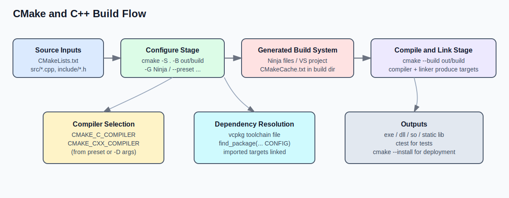

CMake 不是编译器，而是**构建系统生成器**。它的作用是把统一的项目描述（`CMakeLists.txt`）转换为平台可执行的构建脚本（如 Makefile、Ninja、Visual Studio 工程）。

如果你希望 C/C++ 项目做到跨平台、可维护、便于协作，CMake 几乎是必选项。

## 1. 核心概念

先记住三个关键词：

- **源目录（source dir）**：存放 `CMakeLists.txt` 和源码。
- **构建目录（build dir）**：存放中间文件和最终产物。
- **目标（target）**：可执行文件、静态库、动态库等。

推荐始终使用“源构建分离”：

```bash
cmake -S . -B build
cmake --build build
```

为了更直观地理解“CMake 和 C++ 编译过程”的关系，可以先看这张流程图：



## 2. 一个最小可运行示例

项目结构：

```text
project/
├─ CMakeLists.txt
└─ src/
   └─ main.cpp
```

`CMakeLists.txt` 示例：

```cmake
cmake_minimum_required(VERSION 3.20)
project(hello_cmake LANGUAGES CXX)

set(CMAKE_CXX_STANDARD 17)
set(CMAKE_CXX_STANDARD_REQUIRED ON)

add_executable(hello src/main.cpp)
```

构建运行：

```bash
cmake -S . -B build
cmake --build build --config Release
```

## 3. 常用指令速记

### 定义库和可执行文件

```cmake
add_library(core STATIC src/core.cpp)
add_executable(app src/main.cpp)
target_link_libraries(app PRIVATE core)
```

### 添加头文件搜索路径

```cmake
target_include_directories(core
    PUBLIC ${CMAKE_CURRENT_SOURCE_DIR}/include
)
```

### 设置编译选项

```cmake
target_compile_options(core PRIVATE -Wall -Wextra)
```

在 MSVC 与 GCC/Clang 间差异较大时，可以配合条件判断：

```cmake
if (MSVC)
    target_compile_options(core PRIVATE /W4)
else()
    target_compile_options(core PRIVATE -Wall -Wextra -Wpedantic)
endif()
```

## 4. 多目录项目组织

当项目变大后，把模块拆分到子目录会更清晰：

```cmake
add_subdirectory(src)
add_subdirectory(tests)
```

并在各目录维护自己的 `CMakeLists.txt`，通过 target 暴露接口，而不是全局变量到处传。

## 5. Debug / Release 构建

单配置生成器（如 Ninja、Make）：

```bash
cmake -S . -B build -DCMAKE_BUILD_TYPE=Debug
cmake --build build
```

多配置生成器（如 Visual Studio）：

```bash
cmake -S . -B build
cmake --build build --config Release
```

## 6. 引入第三方库的建议

常见方式有三类：

- 系统安装后 `find_package(...)`
- 通过包管理器（vcpkg/conan）
- 源码子模块 + `add_subdirectory(...)`

优先顺序通常是：`find_package` > 包管理器 > 直接拷源码。  
团队协作中应统一依赖版本与获取方式，避免“我机器能跑”的问题。

## 7. 实战中的几个习惯

- 不要在源码目录直接构建，保持目录整洁。
- 尽量使用 `target_*` 系列指令，少用全局设置。
- 目标之间通过依赖关系连接，不手写重复编译参数。
- 在 CI 中固定 CMake 版本和编译器版本，保证可复现。

当项目成长到多平台、多模块甚至多团队协作时，CMake 的价值会非常明显：**把构建规则工程化，而不是把命令堆在脚本里**。

## 8. CMake 常用命令速查

```bash
# 生成构建目录（推荐）
cmake -S . -B build

# 指定构建类型（单配置生成器）
cmake -S . -B build -DCMAKE_BUILD_TYPE=Release

# 编译项目
cmake --build build

# 编译指定配置（多配置生成器，如 VS）
cmake --build build --config Debug
cmake --build build --config Release

# 编译时并行
cmake --build build --parallel

# 运行测试（已启用 CTest）
ctest --test-dir build --output-on-failure

# 安装到指定目录
cmake --install build --prefix ./install
```

## 9. 常见坑：为什么 `cmake --build .` 失败

如果你在源码目录直接执行：

```bash
cmake --build .
```

但当前目录没有 `CMakeCache.txt`，就会报错。因为 `--build` 只能用于**已经配置完成**的构建目录。

推荐固定流程（Ninja）：

```powershell
cmake -S . -B out\build -G Ninja
cmake --build out\build --config Release
```

一句话：先 `-S/-B` 配置，再 `--build` 编译，不要在源码目录裸跑 `cmake --build .`。

## 10. vcpkg 清单模式与基线（`builtin-baseline`）

在清单模式下，`vcpkg` 不会自动长期维护你的 `vcpkg.json` 版本锁定。  
如果缺少基线，常见报错是“需要具有指定基线的清单才能与端口交互”。

### 10.1 基本准备

```powershell
$env:VCPKG_ROOT = "C:\APP\vcpkg"
$env:PATH = "$env:VCPKG_ROOT;$env:PATH"
```

初始化项目并添加依赖：

```powershell
vcpkg new --application
vcpkg add port fmt
vcpkg add port nlohmann-json
vcpkg add port eigen3
```

### 10.2 为什么要基线

- 保证可重复构建（不同时间安装到一致版本）
- 保证团队一致性（不同机器拉到同一依赖快照）

### 10.3 添加基线的方式

方式一（推荐，自动写入）：

```bash
vcpkg x-update-baseline --add-initial-baseline
```

方式二（手动）：

1. 在 vcpkg 仓库执行 `git rev-parse HEAD` 获取 commit hash。
2. 写入 `vcpkg.json` 的 `"builtin-baseline"` 字段。

## 11. CMake + vcpkg 的标准接入

核心点只有一个：让 CMake 使用 vcpkg 工具链文件。

### 11.1 命令行方式

```bash
cmake -S . -B out/build/x64-debug -G Ninja ^
  -DCMAKE_TOOLCHAIN_FILE="C:/APP/vcpkg/scripts/buildsystems/vcpkg.cmake"
cmake --build out/build/x64-debug
```

### 11.2 CMakePresets 方式（推荐团队使用）

在 `CMakePresets.json` 的对应 configure preset 中设置：

```json
"toolchainFile": "C:/APP/vcpkg/scripts/buildsystems/vcpkg.cmake"
```

然后执行：

```bash
cmake --preset x64-debug
cmake --build --preset x64-debug
```

> 注意路径应指向 `scripts/buildsystems/vcpkg.cmake`，不是 vcpkg 根目录。

## 12. CMakePresets 常见问题

### 12.1 为什么看不到 `windows-base`

因为它通常被设置了：

```json
"hidden": true
```

这类 preset 只用于被其它 preset 继承，不会出现在 IDE 的目标选择器里。

### 12.2 `CMakePresets.json` 的价值

- 统一团队构建参数（生成器、架构、构建目录）
- 简化命令（`cmake --preset ...`）
- 改善 IDE 集成（VS/VS Code/CLion 可直接识别）
- 便于管理多配置与跨平台构建

## 13. 控制台乱码与 UTF-8 设置（Windows）

PowerShell 当前会话可临时设置：

```powershell
[Console]::OutputEncoding = [System.Text.Encoding]::UTF8
[Console]::InputEncoding = [System.Text.Encoding]::UTF8
```

如果你希望 C++ 源码按 UTF-8 编译（MSVC），可在目标创建后添加：

```cmake
add_executable(3d ${SRC_FILES})
target_compile_options(3d PRIVATE /utf-8)
```

## 14. `find_package` 新旧模式：优先使用 Config

现代 CMake 更推荐 Config 模式（库自带 `<Pkg>Config.cmake`），而非旧式 `Find<Package>.cmake` 猜测路径。

### 14.1 推荐写法

```cmake
set(CMAKE_FIND_PACKAGE_PREFER_CONFIG TRUE)
find_package(fmt CONFIG REQUIRED)
find_package(nlohmann_json CONFIG REQUIRED)
target_link_libraries(app PRIVATE fmt::fmt nlohmann_json::nlohmann_json)
```

### 14.2 Boost 注意点（CMake 3.30+）

对 Boost 建议显式启用新策略：

```cmake
if(POLICY CMP0167)
  cmake_policy(SET CMP0167 NEW)
endif()
find_package(Boost REQUIRED COMPONENTS filesystem system)
target_link_libraries(app PRIVATE Boost::filesystem Boost::system)
```

### 14.3 项目顺序建议（含 vcpkg）

`CMAKE_TOOLCHAIN_FILE` 应在 `project()` 之前生效。例如：

```cmake
cmake_minimum_required(VERSION 3.20)
set(CMAKE_TOOLCHAIN_FILE "C:/APP/vcpkg/scripts/buildsystems/vcpkg.cmake" CACHE STRING "")
project(my_app LANGUAGES CXX)
```

## 15. 完整工程示例：vcpkg + Presets + 多目录 + FFI + 测试 + 跨平台

这一节合并了“最小示例”和“工程化示例”，给出一套可直接落地的统一模板。你可以先按最小子集跑通，再逐步启用 FFI 与测试。

### 15.1 目录结构（多目录源码）

```text
ffi-demo/
├─ CMakeLists.txt
├─ CMakePresets.json
├─ vcpkg.json
├─ include/
│  └─ ffi_demo/
│     └─ api.h
├─ src/
│  ├─ core/
│  │  └─ calc.cpp
│  ├─ ffi/
│  │  └─ api.cpp
│  └─ app/
│     └─ main.cpp
└─ tests/
   └─ test_calc.cpp
```

### 15.2 `vcpkg.json`（依赖清单）

```json
{
  "name": "ffi-demo",
  "version-string": "0.1.0",
  "builtin-baseline": "YOUR_BASELINE_HASH",
  "dependencies": [
    "fmt",
    "nlohmann-json",
    "gtest"
  ]
}
```

### 15.3 `CMakePresets.json`（指定编译器与跨平台）

```json
{
  "version": 6,
  "configurePresets": [
    {
      "name": "base",
      "hidden": true,
      "generator": "Ninja",
      "binaryDir": "${sourceDir}/out/build/${presetName}",
      "toolchainFile": "C:/APP/vcpkg/scripts/buildsystems/vcpkg.cmake",
      "cacheVariables": {
        "CMAKE_CXX_STANDARD": "20",
        "CMAKE_CXX_STANDARD_REQUIRED": "ON",
        "BUILD_TESTING": "ON"
      }
    },
    {
      "name": "win-msvc-debug",
      "inherits": "base",
      "condition": { "type": "equals", "lhs": "${hostSystemName}", "rhs": "Windows" },
      "cacheVariables": {
        "CMAKE_BUILD_TYPE": "Debug",
        "CMAKE_C_COMPILER": "cl",
        "CMAKE_CXX_COMPILER": "cl"
      }
    },
    {
      "name": "linux-clang-debug",
      "inherits": "base",
      "condition": { "type": "equals", "lhs": "${hostSystemName}", "rhs": "Linux" },
      "cacheVariables": {
        "CMAKE_BUILD_TYPE": "Debug",
        "CMAKE_C_COMPILER": "clang",
        "CMAKE_CXX_COMPILER": "clang++"
      }
    },
    {
      "name": "macos-clang-release",
      "inherits": "base",
      "condition": { "type": "equals", "lhs": "${hostSystemName}", "rhs": "Darwin" },
      "cacheVariables": {
        "CMAKE_BUILD_TYPE": "Release",
        "CMAKE_C_COMPILER": "clang",
        "CMAKE_CXX_COMPILER": "clang++"
      }
    }
  ],
  "buildPresets": [
    { "name": "win-msvc-debug", "configurePreset": "win-msvc-debug" },
    { "name": "linux-clang-debug", "configurePreset": "linux-clang-debug" },
    { "name": "macos-clang-release", "configurePreset": "macos-clang-release" }
  ],
  "testPresets": [
    { "name": "win-msvc-debug", "configurePreset": "win-msvc-debug" },
    { "name": "linux-clang-debug", "configurePreset": "linux-clang-debug" },
    { "name": "macos-clang-release", "configurePreset": "macos-clang-release" }
  ]
}
```

说明：
- 用 `condition` 控制不同平台预设自动显隐。
- `CMAKE_C_COMPILER` / `CMAKE_CXX_COMPILER` 明确指定编译器。
- `testPresets` 让 `ctest --preset ...` 直接可用。

### 15.4 `include/ffi_demo/api.h`（FFI 导出头）

```cpp
#pragma once

#ifdef _WIN32
  #ifdef FFI_DEMO_EXPORTS
    #define FFI_DEMO_API __declspec(dllexport)
  #else
    #define FFI_DEMO_API __declspec(dllimport)
  #endif
#else
  #define FFI_DEMO_API __attribute__((visibility("default")))
#endif

extern "C" {
  FFI_DEMO_API int ffi_add(int a, int b);
}
```

说明：
- `extern "C"` 避免 C++ 名字改编，便于 Python/Rust/C#/Go FFI 调用。
- 用宏统一处理 Windows 与类 Unix 的导出符号。

### 15.5 `CMakeLists.txt`（完整顺序示例）

```cmake
cmake_minimum_required(VERSION 3.24)
project(ffi_demo LANGUAGES C CXX)

include(CTest) # 提供 BUILD_TESTING 选项
set(CMAKE_FIND_PACKAGE_PREFER_CONFIG TRUE)

# 1) 三方库
find_package(fmt CONFIG REQUIRED)
find_package(nlohmann_json CONFIG REQUIRED)
find_package(GTest CONFIG REQUIRED)

# 2) core 静态库（多目录源码之一）
add_library(core STATIC
  src/core/calc.cpp
)
target_include_directories(core
  PUBLIC ${CMAKE_CURRENT_SOURCE_DIR}/include
)

# 3) FFI 动态库（对外 ABI）
add_library(ffi_demo SHARED
  src/ffi/api.cpp
)
target_link_libraries(ffi_demo PRIVATE core)
target_include_directories(ffi_demo PUBLIC ${CMAKE_CURRENT_SOURCE_DIR}/include)
target_compile_definitions(ffi_demo PRIVATE FFI_DEMO_EXPORTS)

# 4) 跨平台编译选项
if (MSVC)
  target_compile_options(core PRIVATE /W4 /utf-8)
  target_compile_options(ffi_demo PRIVATE /W4 /utf-8)
else()
  target_compile_options(core PRIVATE -Wall -Wextra -Wpedantic)
  target_compile_options(ffi_demo PRIVATE -Wall -Wextra -Wpedantic)
endif()

# 5) 可执行程序
add_executable(demo_cli src/app/main.cpp)
target_link_libraries(demo_cli
  PRIVATE
    core
    fmt::fmt
    nlohmann_json::nlohmann_json
)

# 6) 测试目标
if (BUILD_TESTING)
  add_executable(test_calc tests/test_calc.cpp)
  target_link_libraries(test_calc PRIVATE core GTest::gtest_main)
  include(GoogleTest)
  gtest_discover_tests(test_calc)
endif()
```

顺序解释（重点）：
1. `cmake_minimum_required` 在最前，先固定语义和策略。
2. `project` 之后再 `find_package`，让依赖解析具备完整语言上下文。
3. 先建底层 `core`，再建上层 `ffi_demo` 与 `demo_cli`，依赖方向单一清晰。
4. `target_compile_definitions(ffi_demo PRIVATE FFI_DEMO_EXPORTS)` 必须作用在导出库本身。
5. 测试放在 `BUILD_TESTING` 分支，避免生产构建强制依赖测试框架。
6. 编译器由 preset 指定，避免不同开发机“默认编译器不一致”。

### 15.6 构建与测试命令

```powershell
# Windows + MSVC
cmake --preset win-msvc-debug
cmake --build --preset win-msvc-debug
ctest --preset win-msvc-debug --output-on-failure
```

```bash
# Linux + clang
cmake --preset linux-clang-debug
cmake --build --preset linux-clang-debug
ctest --preset linux-clang-debug --output-on-failure
```

### 15.7 不用 Preset 时的等价命令

```powershell
cmake -S . -B out\build\win-msvc-debug -G Ninja `
  -DCMAKE_BUILD_TYPE=Debug `
  -DCMAKE_C_COMPILER=cl `
  -DCMAKE_CXX_COMPILER=cl `
  -DCMAKE_TOOLCHAIN_FILE="C:/APP/vcpkg/scripts/buildsystems/vcpkg.cmake"
cmake --build out\build\win-msvc-debug
ctest --test-dir out\build\win-msvc-debug --output-on-failure
```

```bash
cmake -S . -B out/build/linux-clang-debug -G Ninja \
  -DCMAKE_BUILD_TYPE=Debug \
  -DCMAKE_C_COMPILER=clang \
  -DCMAKE_CXX_COMPILER=clang++ \
  -DCMAKE_TOOLCHAIN_FILE=/opt/vcpkg/scripts/buildsystems/vcpkg.cmake
cmake --build out/build/linux-clang-debug
ctest --test-dir out/build/linux-clang-debug --output-on-failure
```

### 15.8 FFI 调用时的额外建议

- 对外 API 头文件尽量只暴露 C 类型，避免 STL 容器跨 ABI 边界。
- 固定导出函数签名，尽量避免频繁破坏兼容。
- 给 FFI 层单独做集成测试（例如 Python `ctypes` 调用 smoke test）。
