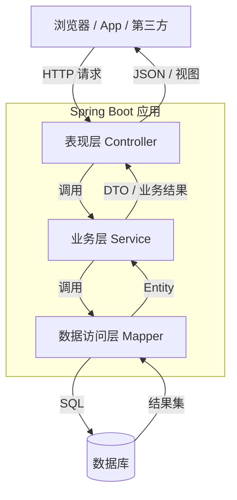
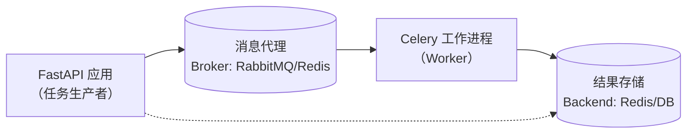

# 近年框架使用总结

本科毕业在即，在这四年里，我使用过很多框架，有时候更多是出于好奇，也有时候是真的出于现实需求。在这个过程我踩过了许多坑，对在何种场景使用何种框架有了更为合理的看法，但受限于学生身份，这些东西可能更加适合初学者或者是缺乏生产实践经验的码农进行阅读。其并不侧重技术讲解，而是告诉大家何种场景使用何种技术较好，是对开发实践中可能经历的阶段的粗浅的引导。


## Spring+Web

### spring boot

这个框架以及其所对应的开发模式比较经典，是我在课程初期学习的方案，在这个过程中我学到了基本的前后端分离开发模式，以及后端基本的分层模式，就如下图所示：



#### 使用体验

在开始阶段，我非常喜欢探索`spring boot`生态中的各种产品和库，此外还有一些周边，比如`ApiFox`能自动扫描controller层接口进行接口文档生成以及接口测试，并且还有众多代码生成器可以使用。而且`spring boot`这套模式开发非常标准化、分层化，经典的注解可以省去许多不必要的编码，让你轻易集成很多外部库或者外部特性到项目中。

话说到这儿，`spring boot`这个框架/生态里面有一切web开发所需要的东西，使用这个进行功能完备的web服务器的开发，那java中的`spring boot`就是不二之选（go虽然也很厉害，但是系统非常庞大的时候，我感觉go有点力不从心，毕竟其“简约”且太年轻了）。

如果利用好该框架下的东西，其实我们需要的做到的事情很少：

> 1. 约定好接口
> 2. 写`service`层的实现
> 3. 剩下的时间就是关注配置问题

其它代码都可以进行标准化生成，写起来非常的爽！

#### 框架评价

Spring Boot 在今天依然是 Java 后端开发的首选，它的核心竞争力几乎都围绕“效率”展开。

- **极致的开发效率**：通过“自动配置”和“起步依赖”，将项目的初始化时间从传统 Spring 的数小时缩短至几分钟，效率可提升40%-60%。
- **强大的生态整合**：它能无缝整合 Spring Cloud（微服务）、Spring Security（安全）、Spring Data（数据）等全家桶，并通过 Actuator 模块提供开箱即用的生产级监控，总之就是只有你想不到，没有它做不到。
- **敏捷的部署运维**：内置 Tomcat 等 Web 服务器，打包成独立 JAR 包后，通过 `java -jar` 即可运行，天然适合微服务和容器化部署（如 Docker、K8s）。
- **庞大的社区生态**：作为Java生态的绝对霸主，其使用率高达42%，开发者社区极为活跃，文档和问题解决方案都非常丰富，出现报错的时候百分之九十九都是前辈已经帮你踩过，一般很容易搜到一个帖子直击问题命门。
- **积极拥抱新趋势**：通过 Spring AI 项目简化大模型集成，并在 Spring Boot 4 中显著提升了 Kotlin 协程的支持与性能

但是和效率有一个一体两面的问题，开发的时候越爽，那出现问题的时候其实系统对开发者来说越是黑盒，找到解决问题的帖子或许很容易，但是定位到问题却是老大难的问题。

#### 学习推荐性

当我们想投入后端开发，Java生态或者是其旗下的`SpringBoot`一定是上上选，甚至是唯一选，未来不一定真的从事Java开发，但是一切后端开发问题以及对应的解决方案和设计思想你都可以通过学习`SpringBoot`得以窥见。

### Vue vs React

#### Vue

Vue非常容易上手，是一个新生的框架，Vue.js 的创始人是 **尤雨溪 (Evan You)**，项目正式诞生于 **2014年2月**是当之无愧的`国货之光`。

其语法非常接近原生HTML开发，并且很多语法糖让小白轻松做到其实内核很复杂的东西，比如数据的双向绑定；并且其有一个权威官方，你能在官方找到所有需要的库，并且不需要在一堆社区生态里面的产品进行纠结也不用太担心官方更新了一个新的版本导致其它配套库没有及时同步造成莫大的困扰。

当Vue可以说是一个年轻现代化富有朝气的框架，生态由于没有先发优势和时间积累，外围周边开发欠佳，并且一些bug的参考方案也较少。

> **Vite**：由 Vue 作者尤雨溪创造的新一代**构建工具**，目前也是是 React 官方推荐用来替代 CRA 的首选，尤大大很厉害！

#### React

React 自己其实是一个专注于构建 UI 组件的“库”，而围绕它衍生出的庞大“生态”，则是一整套用来解决实际开发问题的“框架”和“工具集”。React有众多得力助手，彼此分工明确，帮开发者应对各种挑战，其定位和Java Spring Boot类似，都是在各自的领域里面久经考验并依旧保持活跃。

##### 设计哲学

React 的设计哲学主要体现在以下三个方面，这也构成了它与 Vue 等框架的根本差异：

- **声明式编程**：React 采用声明式范式，开发者只需声明 UI 在不同“状态”（state）下应该是什么样子，而无需像传统命令式编程那样，一步步操作 DOM 来更新界面。这使代码更可预测、更易调试。
- **组件化架构**：React 应用由一个个独立、可复用的“组件”构成。每个组件封装了自己的结构、样式和逻辑，如同乐高积木，可通过组合快速搭建出复杂的用户界面。
- **JSX：JavaScript 的语法扩展**：JSX 允许开发者在 JavaScript 代码中直接编写类似 HTML 的标记，描述了 UI 应有的样子。这种“JSX”语法，实际上是创建 React “元素”的语法糖，使组件代码的结构和逻辑更加直观。
- **虚拟 DOM（Virtual DOM）与高性能**：React 在内存中维护一个“虚拟 DOM”。当状态变化时，它会先在虚拟 DOM 中进行计算，通过高效的“Diff 算法”找出最小差异，再批量更新到真实 DOM。这个机制最小化了昂贵的真实 DOM 操作，从而提升了应用性能

由于笔者以CPP开发为我的编程之路的起点，React的风格非常吸引我，其助我我以一套习惯同时进行前后端以及算法工作的进行，其也是我目前web开发的主力。

##### 优劣

###### 优势

生态！生态！生态！虽然React从自身设计逻辑上存在很多高明的思路值得夸赞，但就实际开发体验上来看，它非常的自由，没有条条框框，你可以按照你的想法找到任何你需要的部件选择你想要的方式进行开发；其无可匹敌的生态更是让其能够完美胜任非常多的细分业务场景，比如其有经典的Next全栈框架以及Remix等服务于不同场景的框架。

而且，市面上一旦出现什么新的产品，你放心，大概率优先和React做适配或者说是适配做得最完善，比如TailWind、Ant Design、Figma等等，并且在VibeCoding阶段，React的沉淀更是被放大了无数倍。

###### 劣势

React作为一个UI库，构建完整应用需自行选择、集成并配置众多生态工具，其没有一个绝对权威的官方告诉你应该使用什么，门槛较高；对于不熟悉函数式编程的人，其学习曲线尤其陡峭，需要理解JSX、组件生命周期、Hooks等概念；技术栈选择灵活但可能导致不同项目间最佳实践不一致。

#### 总结

| 维度         | React                           | Vue                             |
| :----------- | :------------------------------ | :------------------------------ |
| **核心哲学** | 一切皆 JS，函数式               | 拥抱经典 Web 技术，渐进式       |
| **模板**     | JSX（JS 语法扩展）              | 类 HTML 模板 + 指令             |
| **数据变更** | **不可变**（替换状态）          | **可变**（直接修改）            |
| **逻辑复用** | Hooks（纯函数，有调用规则）     | Composition API（更自然的函数） |
| **样式方案** | 生态为主（CSS-in-JS、Tailwind） | 官方支持 Scoped CSS             |
| **项目定位** | 高度灵活，生态由你选            | 开箱即用，约定俗成              |

其实两者也在相互借鉴。Vue 3 的 Composition API 受到了 React Hooks 的启发，而 React 也开始借鉴 Vue 的一些编译时优化技术（如 React Forget）。它们互相取长补短，其实让Web开发面对不同的场景有了更多的选择，举一个简单的例子，如果项目中Web并不庞大，并且前端开发储备不够，其实Vue是不二之选，选择React会有点大材小用，让开发工作出现不必要的繁重感；但如果，目标产品是一个庞大的系统，需要非常多的生态支持，那绝对绕不开React生态。

## Fast Api

这是一个python中的web服务器框架，其在我看来用它的原因就两个字-简单！我利用python开发的时候往往是寄希望其简洁的语法和丰富的库支持做一个初期原型验证，那配合这个`FastApi`框架，会让我省去很多心智负担，如果在项目初期，根本没有部署的需求，有后辈推荐`SpringBoot`那我真得说一句，杀鸡焉用牛刀，何必自找苦吃，这时候就老老实实用`python+FastApi`。

其语法本身很简单，当想要快速部署一个简单的微服务，`FastApi`可以帮我一个大忙，但是到后期接口变多，有了长期维护迭代的念头，那因为python是无类型解释语言并且没有严格的分模块化设计（比如Java一类一文件、接口类和实现类的天然区分），一切的一切都是写在一个`.py`文件中，说真的，项目复杂的时候，无论是自己维护、隔了很久需要变更还是交接给其他人，心智负担无比重，你会发现你写的文档和代码一样多，甚至远远超过代码量。

### 特点

| 特点         | 描述                                                         |
| :----------- | :----------------------------------------------------------- |
| **高性能**   | 性能与Node.js和Go相当，是Python最快的框架之一                |
| **自动文档** | 基于代码类型注解，自动生成交互式API文档（Swagger UI / ReDoc） |
| **数据校验** | 利用Pydantic进行强大的数据验证、转换和序列化                 |
| **原生异步** | 完全支持 `async/await`，适合高并发的I/O密集型场景            |
| **依赖注入** | 内置灵活的系统，用于处理共享逻辑，如数据库会话、认证等       |

FastAPI性能卓越，代码简洁，并拥有活跃的社区生态，已被**微软、Netflix、Uber**等公司广泛用于构建微服务和高性能API。如果能接收python语言天生松散、自由的编程风格，那我觉得拿该框架做大型web开发也没问题，毕竟其实力还是够够的。

### Celery

`FastAPI`是高性能Web框架，`Celery`是一个专注于实时处理、但也支持任务调度的**分布式任务队列系统**，两者相辅相成。其核心架构和工作流程如下：



Celery的**核心功能**包括：

- **异步任务处理**：将耗时操作（如发送邮件、处理文件）转移到后台执行，不阻塞主程序。
- **定时任务调度**：可周期性地执行任务，例如定时清理日志、发送每日报表。
- **分布式执行**：支持在多台服务器上运行Worker，轻松实现水平扩展。
- **任务跟踪**：可以跟踪任务执行状态并持久化结果。

Celery是Python生态中任务队列的**事实标准**，已被Instagram、Spotify等公司用于处理海量后台任务，其实`FastApi`有内部自带的任务队列，但是`Celery`太强大了，而且用起来不是很难，因此框架自带的队列只能说一声抱歉了。

## Tauri 框架

经过一路上对各种开发上的各种牛掰的产品的尝试，世界线终于收束了，这是我末期的遇到的最贴合我工作需要的一个产品，并计划我以后的初期开发演示都会使用这个框架进行。

到了末期，我发现面对开发任务，掌握驳杂的的生态、语言、框架等等对于我的负担实在太重，我并非直接面对生产实践的上线需求，也不可能一个人精通所有的东西，互联网积累太庞大了。

据我已经投身到企业中的同学说：一个人学习开发，重点并不在于你尽可能掌握所有的语言、框架等等的使用，这些不是说没有用处，只不过常人是没有那么多精力做到广而精，而一个人的核心竞争力往往是精通，但是对于其背后的设计原则以及面对的生产问题是值得每个人深入，这些藏匿于工具之后的历史才值得思考理解。

经过web开发的各种折磨，我决定放弃在这方面的深入，关于理论和思想我依旧会去学习，但是对于工具的熟练度积累我将不再推进或者是放缓，Tauri这个新的框架现在已经能够满足几乎我所有的小规模的开发场景，在开发上的心智负担也大大降低。

### 简介

Tauri 是一个用于构建桌面和移动应用的跨平台框架，它使用 Rust 作为后端，并允许开发者使用任何能编译为 HTML、JavaScript 和 CSS 的前端框架（如 React、Vue、Svelte 等）来构建用户界面。与 Electron 不同，Tauri 不会捆绑整个浏览器引擎（如 Chromium），而是直接利用操作系统自带的 WebView（如 Windows 上的 WebView2、macOS 上的 WKWebView、Linux 上的 WebKitGTK）进行渲染。

这种架构使 Tauri 应用体积极小，一个最小的 Tauri 应用可以小于 **600KB**。安全性上，Tauri 基于 Rust 构建，能够利用 Rust 的内存、线程和类型安全优势，即使你不是 Rust 专家，构建的应用也能自动获得这些安全特性。

> 你问我为什么不用`Electron`，因为我并不喜欢`JavaScript`这些动态/弱类型语言，`python`也不是非常喜欢，奈何它太便捷了。 
>

### 创建项目

使用 `create-tauri-app` 工具快速初始化项目：

```bash
# 使用 npm
npm create tauri-app@latest

# 使用 yarn
yarn create tauri-app

# 使用 pnpm
pnpm create tauri-app
```

创建过程中会提示选择前端框架和包管理器，根据你的技术栈选择即可。

### 调用外部程序服务

#### 原因

`Rust`虽然设计很现代化，内里的设计能够极大避免将坑留到运行时爆发，并且还有其它很多巧思比如借用、所有权、生命周期等等，开发起来还是比较舒服了，但其与其老大哥`Cpp`的关系就像`React`和`Vue`或者是`Java`和`Go`。

其有统一的包管理器帮开发者便捷解决依赖安装问题，并且没有厚重的历史包袱，但是很遗憾，它太年轻了，没有足够的沉淀，生态不够完善，踩坑不够多，其本身语言的迭代可以说是还没有做到像`cpp`一样尽善尽美，这一点经常去社区或者官方仓库下冲浪的人应该是懂的。

而且对于开发者，暂时不考虑那些精妙的设计，其实`Rust`碾压`CPP`的优势其实只有一个包管理器，其社区一些小鬼/水军鼓吹的特性其实都是在和旧版`CPP`的对比，而当谈及CPP那些新特性，他们往往又直接会回怼一句“你那不是零成本抽象！你有历史包袱！项目依旧停留在CPP11！”，我只能说气笑了。

并且就难用程度上，哈哈，我觉得`Rust`一点不比`CPP`好很多，其语言风格还是非常之抽象的；至于可读性，这两货半斤八两，可能`Rust`现在因为后发的优势，包袱比较少，可读性稍好。

`Rust`现在比较适合造轮子，其做不到像`CPP`、`Java`那样在各自的领域无所不包、开箱即用，因此我在使用`Tauri`框架的时候关键后端服务总是通过外部调用而不是直接用`Rust`进行编写，我尝试过去用`Rust`构建，但是很遗憾，不仅仅自己劳心劳力，后辈去交接也是非常的难。

#### 方案对比

Tauri 调用外部库/服务的策略可归结为三大类，取决于外部库的**形态**（网络服务、独立程序、动态链接库）：

##### 调用网络服务（HTTP/gRPC等）
| 方案              | 实现方式                                            | 特点                                       | 适用场景                             |
| :---------------- | :-------------------------------------------------- | :----------------------------------------- | :----------------------------------- |
| **前端直接调用**  | 在 JS 中使用 `fetch` / `axios`                      | 最简单，受浏览器 CORS 和连接数限制         | 少量、简单的 API 请求                |
| **Rust 后端代理** | 前端调用 Tauri 命令，Rust 使用 `reqwest` 等发起请求 | 高性能、高并发、无 CORS 限制，可预处理数据 | 高频请求、复杂数据处理、需更高安全性 |

##### 调用本地独立程序（.exe / 脚本）
| 方案                 | 实现方式                                           | 特点                                     | 适用场景                                   |
| :------------------- | :------------------------------------------------- | :--------------------------------------- | :----------------------------------------- |
| **Sidecar（推荐）**  | 将可执行文件打包，作为子进程通过 stdin/stdout 通信 | 集成度高、随应用启停、进程隔离安全       | 集成 Python/C++ 命令行工具、长期运行的服务 |
| **System Shell**     | 使用 `shell` 插件直接执行系统命令                  | 灵活但需严格权限控制                     | 调用系统命令（git、ffmpeg）、一次性脚本    |
| **Localhost Server** | 外部程序作为 HTTP 服务器运行，前端 `fetch` 通信    | 协议通用易调试，需管理端口和进程生命周期 | 外部程序本身就是 Web 服务                  |

##### 调用动态链接库（.dll / .so / .dylib）

这是我觉得最好的方式，我在进行`cpp`服务开发的时候会使用此方式，因为其`CMake`很适合做这种事情，反过来如果想要把`CPP`做到像一个web服务器一样供其它地方调用，那我推荐买几个六个核桃，并非嘲讽，因为确实很难。

| 方案                                   | 实现方式                                                     | 特点                                                         | 适用场景                                      |
| :------------------------------------- | :----------------------------------------------------------- | :----------------------------------------------------------- | :-------------------------------------------- |
| **Rust FFI 直接调用**                  | 在 Rust 后端使用 `libloading` 或 `extern "C"` 加载 DLL，通过 Tauri 命令暴露 | **性能最高**（同进程函数调用），但隔离性差（崩溃影响主程序） | 高性能计算库、频繁调用的底层算法              |
| **Python → C 接口库（Cython/Nuitka）** | 将 Python 代码编译为 C 动态库，再通过 Rust FFI 调用          | 兼顾 Python 生态与 C 性能，需额外编译步骤                    | 复用 Python 科学计算/机器学习代码且追求高性能 |

##### 快速选型指南

- **调用现成 HTTP API** → 前端直接 `fetch`（简单）或 Rust 代理（高性能）。
- **集成 Python/Node.js 脚本或独立 .exe** → **Sidecar**（首选）。
- **执行系统命令** → System Shell（注意安全）。
- **调用已有的 C/C++ DLL** → Rust FFI。
- **将 Python 算法库高性能集成** → Cython 编译成 DLL + Rust FFI。

我觉得如果是自己开发一些迭代期间的项目，还是避免HTTP服务调用，网络问题会给开发带来很多额外的工作量，对于小团队没有必要。

## 契约中间件

契约中间件是一种基于接口定义（IDL）来驱动服务间通信、数据校验、代码生成与治理的中间件层。其核心理念是 **“契约先行”**——服务提供方与消费方在编码前先共同定义一份中立、结构化的接口描述文件（如 `.proto` 或 `openapi.yaml`），中间件据此自动生成客户端 SDK、服务端骨架、数据校验逻辑及 API 文档，从而确保通信双方的“约定”在构建时即被强制遵守。

直观点就是，有了契约，很多接口代码都可以自动生成，省去很多工作量，当然已有的代码生成器也许不符合实际需求，一些公司会自己手搓一个代码生成器自用，毕竟也不是什么太难的系统工程。

### 基于 Protocol Buffers 的契约中间件

#### 填充内容说明
`.proto` 文件是 Protocol Buffers 的接口定义语言，通常包含：

- **syntax** 版本声明（`proto3` 为主流）
- **package** 命名空间
- **service** 定义 RPC 方法及其请求/响应类型
- **message** 定义结构化数据字段、类型、编号及可选的验证规则（需借助 `protoc-gen-validate` 等插件）

中间件生态（如 gRPC、gRPC-Web、buf）会解析 `.proto`，生成对应语言的强类型客户端、服务端接口及序列化代码。

#### 典型应用场景
- **微服务内部高性能通信**（gRPC）：服务间调用频繁，对延迟、带宽敏感，且需严格类型约束。
- **多语言异构系统集成**：通过 `protoc` 生成 Java、Go、Python、C++ 等客户端，避免手写协议解析。
- **流式数据处理**：gRPC 的客户端/服务端/双向流特性适合日志上报、实时推送、大数据管道。
- **移动端与后端通信优化**：配合 gRPC-Web 减少 JSON 解析开销，提升弱网体验。

#### 优劣分析

| 优势                                                         | 劣势                                                         |
| ------------------------------------------------------------ | ------------------------------------------------------------ |
| **极致性能**：二进制序列化（varint、packed）体积小、编解码快，网络开销低。 | **可读性差**：二进制格式无法直接用浏览器调试，需借助 `grpcurl` 或反射工具。 |
| **强类型契约**：字段编号保证向后兼容性，编译期类型检查杜绝运行时拼写错误。 | **前端集成门槛高**：浏览器原生不支持 gRPC，需通过 Envoy/gRPC-Web 代理。 |
| **生态丰富**：内置流控、截止时间、拦截器，且社区工具链成熟（如 `buf` 替代 `protoc`）。 | **JSON 映射不完美**：`int64` 在 JavaScript 中精度丢失，`oneof` 等结构需特殊处理。 |
| **版本管理清晰**：通过保留字段编号、`reserved` 关键字安全演进 API。 | **学习曲线**：团队需理解 wire 格式、编号复用规则，维护成本高于纯 JSON REST。 |

### 基于 OpenAPI 的契约中间件

#### 填充内容说明
OpenAPI Specification（原 Swagger）是 RESTful API 的描述标准，格式为 YAML 或 JSON。核心结构包括：

- **openapi** 版本号
- **info** 元数据（标题、描述、联系方式）
- **servers** 基础 URL
- **paths** 路由及 HTTP 方法对应的操作（`get`、`post` 等）
- **components** 可复用的 `schemas`（数据模型）、`parameters`、`securitySchemes`

契约中间件可基于此规范生成交互式文档（Swagger UI）、客户端 SDK（OpenAPI Generator）以及服务端校验中间件（如 Express 的 `openapi-validator`）。

#### 典型应用场景
- **对外公开的 Web API**：合作伙伴或前端开发者可直接阅读文档并进行调试。
- **前后端分离协作**：前端通过 Mock Server（基于 OpenAPI 契约）并行开发，后端按契约实现。
- **API 网关治理**：网关根据 OpenAPI 定义进行路由、参数校验、鉴权及限流。
- **遗留系统改造**：为已有 HTTP 服务补充 OpenAPI 描述，渐进式引入标准化治理。

#### 优劣分析

| 优势                                                         | 劣势                                                         |
| ------------------------------------------------------------ | ------------------------------------------------------------ |
| **人类可读性极强**：YAML/JSON 文本格式，浏览器内即可查看、测试。 | **性能相对低**：JSON 序列化体积大、解析慢，无内置二进制流支持。 |
| **工具链完善**：Swagger Editor、Postman、Stoplight 等可视化工具降低使用门槛。 | **约束力弱**：契约与实现易脱节，若无强制校验中间件，运行时仍可能错配。 |
| **前端友好**：原生 `fetch` 即可调用，TypeScript 类型可从 OpenAPI 自动生成（如 `openapi-typescript`）。 | **描述能力局限**：某些业务语义（如精确的 `int64`、二进制流）需用扩展字段补充。 |
| **版本演进平滑**：通过 `deprecated` 标记字段，且 JSON 可自然容忍增删字段。 | **规范细节复杂**：`allOf`、`oneOf`、`discriminator` 等高级特性学习成本不低。 |

### Proto 与 OpenAPI 的对比与选型建议

| 维度             | Protocol Buffers + gRPC         | OpenAPI + REST/HTTP             |
| ---------------- | ------------------------------- | ------------------------------- |
| **契约载体**     | `.proto` 二进制导向             | `.yaml` / `.json` 文本导向      |
| **主要通信模式** | RPC 方法调用 + 流式             | 资源导向（GET/POST/PUT/DELETE） |
| **最佳适应场景** | 内部微服务、低延迟流式          | 对外公开 API、浏览器直连        |
| **开发体验**     | 强类型生成，编译期安全          | 文档即契约，调试直观            |
| **生态集成**     | gRPC 生态（负载均衡、服务发现） | HTTP 生态（缓存、CDN、网关）    |

**实践建议**：

- **内部服务间优先考虑 Proto 契约**，利用 gRPC 获得性能与类型安全红利。
- **对外或跨组织边界优先 OpenAPI**，降低对接方理解成本与调试门槛。
- **混合使用**：网关层将外部 OpenAPI 请求转换为内部 gRPC 调用，兼顾内外优势。

契约中间件的价值最终取决于 **契约的强制执行力度**——无论选择哪种格式，都应通过 CI 流程确保实现与契约的持续一致性（如 `buf breaking` 检测 Proto 不兼容变更，或使用 `openapi-diff` 检查 API 演进）。二者面向的业务场景交叉很少，其实不用很纠结。

## 队列

消息队列在服务开发中，通过**异步、解耦、削峰**三大核心能力，成为构建高并发、高可用分布式系统的基石。它像一个“中间人”，负责可靠地传递消息，从而解决一系列系统架构难题。

我个人开发的时候是因为解耦和异步，项目团队初期试验都采用python生态进行开发，但是实际服务器采用了`SpringBoot`但是没有采用非常好的微服务布局，团队里对`Java`部署也是非常执着，不愿冒险，因此只得构建一个服务间通信渠道，初期想要在内网多套一层`HTTP`服务接口通信，但是无论是工作量还是性能都不达标；并且核心服务是计算密集型任务，耗时长且内存占用高，最优解最后敲定为队列。

### 消息队列的核心作用

*   **异步处理 (Asynchronous Processing)**：将非核心的耗时任务（如发送邮件、生成报表）从主流程中剥离，交由后台队列处理。主线程可以立即响应用户，从而极大提升系统的响应速度和吞吐量。根据Gartner报告，采用此架构的企业系统平均响应时间降低了43%。
*   **系统解耦 (System Decoupling)**：作为服务间的缓冲层，让生产者和消费者不再直接依赖。即使下游系统发生故障或变更，上游系统也能继续正常运行，实现故障隔离，显著提升系统的鲁棒性。Gartner报告也指出，这使故障传播率下降了近60%。
*   **流量削峰填谷 (Traffic Shaping / Peak Load Management)**：在流量洪峰场景下，消息队列能暂存海量请求，让后端服务能以其能够承受的平稳速率消费，有效防止系统因瞬时压力而崩溃。
*   **数据同步与一致性保障 (Data Synchronization & Consistency)**：通过顺序写入的日志结构，队列可以作为可靠的数据管道，实现系统间的数据同步与最终一致性。例如，利用Canal等工具监听MySQL变更并投递到MQ，下游系统消费后更新Redis、ES等，保证数据的有序性和一致性。
*   **顺序保证 (Ordering Guarantee)**：对于要求严格顺序的业务（如订单状态流转），可以利用消息队列的特定机制（如Kafka分区、RocketMQ顺序消息）来保证消息的全局或局部有序处理。

### RabbitMQ vs. Kafka

两者都旨在解决分布式系统中的消息传递问题，但设计哲学与核心架构截然不同，导致它们的最佳应用场景也大相径庭。

| 对比维度       | 🐰 RabbitMQ                                                   | 🐘 Kafka                                                      |
| :------------- | :----------------------------------------------------------- | :----------------------------------------------------------- |
| **核心定位**   | 通用的消息代理（Message Broker）                             | 分布式流处理平台（Streaming Platform）                       |
| **设计哲学**   | 智能代理（Smart Broker），负责路由、投递、确认               | 智能消费者（Smart Consumer），代理只存储有序日志，消费者管理消费进度 |
| **协议模型**   | AMQP，基于 Exchange/Queue 的路由模型                         | 自定义TCP协议，基于 Topic/Partition 的日志模型               |
| **消息吞吐量** | **万级 TPS**：约 4K - 10K 条/秒                              | **百万级 TPS**：可达约 1M 条/秒或更高                        |
| **消息延迟**   | 低吞吐时**微秒级**，高吞吐时延迟显著上升                     | **毫秒级**，可达 2-10ms                                      |
| **消息顺序**   | 单个队列内可保证，多消费者/重试下易乱序                      | 单个分区（Partition）内严格有序                              |
| **消息持久化** | 消费后默认删除（可持久化）                                   | 基于时间的保留策略，可重复消费（Replay）                     |
| **消息路由**   | **非常强大**：支持 Direct, Fanout, Topic, Headers 等多种方式 | **相对简单**：基于分区Key的哈希路由，支持主题通配符订阅      |
| **消费模式**   | 以 **Push** 为主（也支持Pull），队列竞争消费                 | 严格的 **Pull** 模型，消费者按需拉取                         |
| **运维复杂度** | 相对简单，内置管理界面友好                                   | 较复杂，需管理分区、副本、ISR，传统依赖Zookeeper             |
| **高级特性**   | 开箱即用：TTL、死信队列（DLX）、延迟/优先级队列              | 功能侧重不同：消息重放、与Flink/Spark深度集成                |
| **社区生态**   | 生态成熟，客户端丰富，兼容 AMQP/MQTT/STOMP 等                | 大数据生态集成紧密，与Hadoop/Spark/Flink等无缝对接           |

> **注**：性能指标受硬件、网络、配置等因素影响。例如，有研究指出在.NET环境下Kafka性能更优，而在Spring Boot中RabbitMQ内存效率更高。对于web服务开发，多数场景选择RabbitMQ即可。

### 如何选择

#### 优先选择 RabbitMQ 的场景

1. **复杂业务路由**：如电商订单需根据类型、金额等复杂规则分发到不同系统，RabbitMQ的灵活路由是理想选择。
2. **企业应用集成**：需要集成多种协议（如IoT设备用MQTT，传统系统用AMQP），RabbitMQ的多协议支持是巨大优势。
3. **对消息可靠性要求极高的任务**：如金融交易通知、核心业务流程，其完善的确认机制和死信队列功能能提供有力保障。
4. **中小规模、功能需求多样的系统**：吞吐量要求不高（< 10k TPS），但需要延迟队列、优先级等特性，RabbitMQ更合适。

对于我的项目，其规模较小，并且长时间计算密集型任务需要时序性和可靠性，这样才能做到数据流监控，避免数据流出错或者状态反馈不及时导致服务停机下线。

#### 优先选择 Kafka 的场景

1. **大数据实时处理**：处理海量用户行为日志、应用监控数据、物联网设备事件流等，Kafka的超高吞吐和水平扩展能力是核心优势。
2. **需要消息回溯的场景**：因程序故障需从特定时间点重放历史数据进行分析或修复，Kafka的日志存储模型完美支持。
3. **流式计算与事件溯源**：作为Flink/Spark等流计算框架的数据源，或利用事件日志重建系统状态，Kafka是事实标准。
4. **对吞吐量有极致要求的大规模系统**：日均消息量超过亿级，Kafka在成本和性能上通常更具优势。

> **提示**：在实践中，**混合架构**也是一种常见策略，二者并不互斥。例如，可以用Kafka作为全局数据总线汇集海量事件，再通过如Kafka-RabbitMQ连接器，将需要复杂路由的业务事件桥接到RabbitMQ中处理，实现优势互补。

## 数据库

### 关系型数据库

MySQL 和 PostgreSQL 这两位基本就是关系型数据库里的“常青树”。如果只看“能不能用”，两者都能把活干好；但如果看“在团队里长期维护是否舒服”，差异其实非常明显。

我早期项目基本都从 MySQL 起步，原因很现实：教程多、部署简单、云厂商支持完善，踩坑时一搜几乎都有答案。对于课程项目、后台管理系统、中小型业务，MySQL 的上手效率确实很高，配合 ORM 或者 MyBatis 这类工具，开发速度非常可观。

而 PostgreSQL 给我的感觉是“更严谨、更现代”。它在 JSONB、复杂查询、GIS（PostGIS）以及事务一致性方面体验更好，适合业务规则复杂、数据关系深、后续演进可能性大的系统。说白了，如果你一开始就知道项目后期会长成一个“复杂系统”，那 PostgreSQL 往往更稳妥。

#### 简单选型建议

- **追求上手速度、团队经验偏 Java/MySQL**：优先 MySQL。
- **数据模型复杂、需要高级特性（JSONB/窗口函数/GIS）**：优先 PostgreSQL。
- **不确定未来规模**：先选团队最熟悉的一套，预留迁移策略比“盲目追新”更重要。

### 非关系型数据库

“NoSQL”并不是某一种数据库，而是一类数据库思想：不强制所有数据都塞进固定表结构，而是按场景选择更灵活的数据模型。MongoDB 和 Redis 就是我使用频率最高的两种。

### MongoDB

MongoDB 更像“文档型数据库”，非常适合前期需求还在频繁变动的场景。它的 BSON 文档结构和前端 JSON 心智模型高度一致，做原型验证、内容管理、日志存储会非常顺手。

缺点也很明显：一旦业务进入复杂事务和多表强关联阶段，你会怀念关系型数据库的约束能力。

### Redis

Redis 在我这里更多扮演“系统加速器”和“状态中间层”的角色，而不是主存储。最常见用途包括缓存热点数据、分布式锁、限流计数、会话存储、消息发布订阅等。

#### 使用场景

1. **MongoDB**：迭代快、模型灵活，适合原型和半结构化数据。
2. **Redis**：高性能内存读写，适合缓存和高频状态管理。
3. **核心业务数据**：尽量仍由关系型数据库兜底，NoSQL 做增强而不是“全盘替代”。

### MinIO

我在项目里通常把图片、视频、模型文件、日志归档、备份包等大文件交给`MinIO`管理，数据库里只保存元数据和访问路径。这样做的好处是非常直观的：数据库不会被大文件拖垮，文件读写也能独立扩展。

`MinIO`最大的优势是兼容`S3`协议，迁移成本低，且私有化部署非常友好。对学校项目、小团队内部系统、或有数据合规要求的场景来说，这一点非常实用。它并不负责复杂查询和事务，你不能把它当成 MySQL/MongoDB 的替代品，你可以把它当作一个牛掰的平台无关的文件管理系统，其底层存储逻辑当然不和实际的文件系统一样，但是对用户来说，其实就像操作一个强大的文件系统一样。

#### S3协议

S3协议（全称 Amazon Simple Storage Service）是亚马逊云科技（AWS）在2006年推出的一种对象存储服务接口。它并非一个独立的底层网络协议（如TCP/IP），而是一套基于 **HTTP/HTTPS** 的应用层接口规范，也就是一套标准化的 **RESTful API**。通过这套API，开发者可以像操作本地文件一样，用编程的方式管理云端的海量数据。

##### 核心概念：一个扁平的“文件柜”

S3协议的组织结构非常扁平，不像传统文件系统那样有复杂的多层文件夹，你可以把它想象成一个巨大的、但结构简单的“文件柜”：

1. **存储桶（Bucket）**：存储对象的顶级容器，可以理解为文件柜里的一个“抽屉”。每个“抽屉”的命名必须是全局唯一的，你可以在其中设置访问权限、生命周期规则等。
2. **对象（Object）**：存储的基本单元，就是存放在“抽屉”里的“文件”。一个对象由三部分组成：
   1. **键（Key）**：对象的唯一标识符，例如 `photos/2024/summer.jpg`。虽然看起来像路径，但在S3中，整个字符串就是一个简单的“文件名”，它通过 `/` 前缀为UI模拟出文件夹的视觉效果。
   2. **值（Value）**：对象存储的实际数据流，单个对象最大可达 **5TB**。
   3. **元数据（Metadata）**：描述对象属性的键值对，如文件类型、大小、自定义标签等，方便管理和检索。

##### 工作原理

S3协议通过标准的HTTP方法和URL来管理数据，主要通过以下三类API进行操作：

1. **服务级别（Service-level）API**：管理所有存储桶，例如 `GET /` 请求可以列出你账户下的所有“抽屉”（存储桶）。
2. **存储桶级别（Bucket-level）API**：管理特定存储桶，例如 `PUT /{bucket-name}` 请求用来创建一个新“抽屉”，`DELETE /{bucket-name}` 则用来删除它。
3. **对象级别（Object-level）API**：管理具体对象，例如 `PUT /{bucket-name}/{object-key}` 用来上传文件，`GET` 用来下载，`DELETE` 用来删除。

#### 相比“直接操作磁盘文件”的优势

很多人会问：我直接把文件写到服务器磁盘不就行了，为什么还要多一层 MinIO？ 我的体会是，单机阶段两者差距不明显，但一旦进入多人协作和线上环境，对象存储的优势会迅速放大：

1. **统一访问协议**：通过 S3 API 读写，不再依赖某台机器的本地目录结构，应用迁移和扩容更轻松，这非常重要，不需要另一个人接手开发的时候因为一些关于路径的配置没改动而报错，特别是有些时候过分地写成绝对路径。
2. **天然解耦计算与存储**：应用服务可以随时重建或水平扩容，文件依旧在独立存储层，不会跟着容器生命周期一起“消失”。
3. **权限与安全治理更规范**：可基于桶策略、访问密钥、临时签名 URL 做细粒度授权，这些都是MinIO系统自带地功能，比自己手搓更便捷可靠。
4. **高可用与可靠性更好**：对象存储可通过副本/纠删码等机制提升容灾能力，避免“磁盘坏了文件全没”的单点风险。
5. **管理能力更完整**：支持生命周期管理、版本控制、分片上传、跨节点共享访问，省掉大量自建文件系统逻辑。

简单讲：直接用磁盘是“能存文件”，而 MinIO 这类对象存储是“可治理、可扩展、可运维地存文件”。

### 实践建议

- **结构化数据**：交给 MySQL / PostgreSQL。
- **高频临时状态与缓存**：交给 Redis，当然有些库也会依赖Redis，比如Celery。
- **大文件与静态资源**：交给 `MinIO`。
- **组合使用**：这是常态，不是“技术栈不纯”。

## 微服务

微服务这块我用得最多的是 `Nacos + Spring Cloud` 这套组合。它不是银弹，但在 Java 生态里确实成熟、资料多、可落地。由于我没有正式进入超级大厂参与到开发工作中，很多时候这方面感受来自于已经工作日久的同学，以及我以实习状态进入一些公司参与一些简单工作顺手偷来的**经验**。

先说结论：如果团队还在早期，业务规模不大，千万不要为了“看起来先进”强上全套微服务。微服务带来的不仅是拆分自由，还有配置管理、链路追踪、部署编排、故障排查、分布式事务等整套复杂度。很多时候，单体 + 良好分层就够用了。

### Nacos

`Nacos`在我的实践里主要承担两件事：

- **服务注册与发现**：让服务实例可以动态上下线，调用方不用写死地址。
- **配置中心**：把环境配置从代码里剥离出来，支持集中管理和动态刷新。

对于多环境部署（dev/test/prod）和多人协作来说，Nacos 的价值非常高，尤其能减少“我本地能跑、线上挂了”的配置类问题。

### Spring Cloud

Spring Cloud 更像是“微服务工具箱”，而不是单一框架。我最常用的能力主要是：

1. **网关（Gateway）**：统一路由、鉴权、限流。
2. **服务调用（OpenFeign）**：声明式远程调用，减少模板代码。
3. **熔断与容错（Circuit Breaker）**：避免级联故障。
4. **链路追踪与监控**：帮助快速定位跨服务问题。

它的优点是标准化程度高，和 Spring Boot 衔接顺滑；缺点是组件多、概念多，学习和运维成本都不低；但是其是微服务领域的集大成经典之作，可以不用，但是去理解背后设计逻辑很有必要。

### 什么时候该上微服务

1. **适合**：多团队并行开发、业务边界清晰、服务规模持续增长、对弹性扩容有明确需求。
2. **不适合**：项目早期、团队人少、业务还在频繁试错阶段。

微服务解决的是“规模化协作和演进问题”，不是“让项目看起来更高级”的问题，我在课程设计任务的时候做过一些微服务的尝试，这个过程很爽，多项目协作非常舒适，但是起码得有一个服务器做常态部署和接入服务，对于个人开发者如果想要容器编排实现这种微服务也可行，但是没必要。

## 编程语言

### CPP RUST

如果只谈“我写起来最顺手、最有掌控感”的语言，那一定是 C++。它给了我非常强的底层控制能力，也让我养成了对性能、内存、数据结构边界的敏感度，语言越底层，那么就越接近机器，思考层次越接近机器，很多奇怪的代码逻辑和设计就会变得非常自然合理。很多时候这种思维方式，比具体语法本身更重要。

Rust 则像一门“强约束的现代系统语言”。它确实在安全性、包管理、工程规范上比传统 C++ 友好很多，尤其在并发安全上有天然优势；但它也确实不轻松，所有权、借用、生命周期在项目初期会带来明显学习成本。

我自己的结论是：两者不是替代关系，更像互补关系，`RUST`正在蚕食`CPP`的一些生态，`CPP`不会没落，`RUST`短期也不会称霸。

1. **C++**：生态沉淀深、性能上限高、历史项目多，适合底层核心模块和高性能库。
2. **Rust**：安全性强、工程一致性好，适合新项目里对稳定性和并发正确性敏感的部分。
3. **实际落地**：别纠结“谁更先进”，先看团队现有积累和交接成本。

我个人不推荐任何不会`CPP`的编码者以Rust作为自己的第一门语言。其一，`RUST`并非现在求职、升学、研发环境中的主力语言；其二，`CPP`是系统开发、高性能编程等领域的经典之作，其厚度不是`RUST`可以碰瓷的，以`RUST`为范本去学习编程就像看中国只看近代史而不看古代，而且——`RUST`是真的很难写，如果没人去吹嘘`RUST`，那其将有可能会因为没人使用而默默死亡哈哈。

### Java Go

Java 和 Go 在后端里都很能打，但风格完全不同，Java 偏“体系化”、Go 偏“极简实用化”。

#### Java 

最强的地方在于：生态完整、框架成熟、企业级方案齐全。尤其是 Spring 生态，把很多工程问题都标准化了，团队协作和长期维护会更稳。代价是：配置、概念、抽象层级较多，新人需要时间建立全局认知。

#### Go 

`Go`给我的体验是“写得快、跑得轻、部署省心”。单二进制交付、启动快、并发模型简单直接，非常适合云原生服务和基础设施工具。它的短板是表达能力偏克制，复杂业务的建模和抽象有时不如 Java 舒展，某些场景会写出很多重复样板。

##### 语言特性

Go生态的主力在**云原生基础设施、微服务和高并发的后端服务**领域，可以说是当之无愧的“云原生时代的C语言”。

1. **设计哲学**：Go做“减法”，极简语法利于团队协作；Java做“加法”，体系完善，面向对象。
2. **并发模型**：Go的轻量级`goroutine`启动极快（约200ns），支持百万级连接；Java的线程模型较重量级，虚拟线程正在改进中。
3. **性能与资源**：Go编译型语言启动快（毫秒级）、内存占用低（空载约5MB）；Java依赖JVM，启动慢（数百毫秒）、内存开销较大。
4. **部署与生态**：Go部署极简（单二进制文件），但生态较新、更聚焦；Java部署复杂（需JRE），但生态极其庞大，是企业级应用的标准。

##### Go的主力应用领域

1. **云原生基础设施**：这是Go的“自留地”，云原生基金会的标杆项目如**Kubernetes**、**Docker**、**etcd**、**Prometheus**、**Istio**等，均采用Go语言编写。
2. **微服务与API网关**：Go是构建高性能微服务的理想选择，支持快速迭代和水平扩展。例如，Goa框架基于设计优先理念构建API，确保契约的准确性；Dapr Go SDK则能帮助初创团队将开发周期缩短40%。
3. **高并发网络服务**：在需要处理海量并发连接的场景下表现卓越。像**Uber**（处理实时地图更新与动态定价）、**Dropbox**（替换了原有的Python服务）、**Twitch**（处理实时视频流与聊天服务）等公司，都利用Go的这一特性构建了核心业务。

#### 使用建议

1. **复杂业务系统、长周期维护、多人协作**：Java 更稳。
2. **高并发网络服务、云原生组件、微服务基础设施**：Go 更省心。
3. **别陷入语言信仰**：核心是解决问题效率和团队可持续性。

### python

Python 对我来说是“验证想法的加速器”。  当一个需求还在探索期、方案还在试错期，Python 基本是最低心智负担的选择：语法简洁、库丰富、脚本能力强，能非常快把原型跑起来。

我最常在三类场景用它：

1. **快速原型与工具脚本**：把想法先落地，优先验证可行性。
2. **数据处理与自动化**：生态成熟，很多轮子开箱即用。
3. **AI 相关工程**：主流框架和社区资源都优先覆盖 Python。

但它的问题也很真实：大型工程中，如果缺少严格规范（类型标注、分层约束、测试体系），代码很容易在迭代中变“松散”，后期维护和交接成本会明显上升。

一句话：Python 非常适合“快”，但要长期“稳”，需要你主动补工程化约束。

### ts/js

JavaScript/TypeScript 基本是现代前端绕不开的地基。如果 JS 是事实标准，那 TS 就是把这套标准从“能跑”推进到“可维护”。

#### 投身TS原因

直接原因是我比较喜欢“有类型”的语言，没有类型的开发对我来说是码字一时爽，事后无尽痛苦。

我自己的实践里，TS 的价值也不仅仅是“有类型”这么简单，更重要的是它显著降低了多人协作时的沟通损耗：接口契约更清晰、重构更安全、IDE 提示更可靠。对于我的`React/Vue`项目，TS 几乎已经从“可选项”变成“默认项”。

当然，前端生态更新速度太快，工具链迭代也很频繁，这会带来持续学习压力。我的处理方式是：核心选型尽量保守（主流框架 + 主流构建工具），避免把项目绑在过于前沿但不稳定的方案上。

#### 经验建议

其实没啥可建议的，学的时候可以看一手JS，实际开发直接用TS就好了，TS是JS的超集，二者本质上没啥区别。

1. **新项目优先 TS**，除非只是一次性脚本页面。
2. **少折腾花哨工具链**，优先稳定与团队熟悉度。
3. **前端真正的难点不在语法**，而在状态管理、边界划分和工程组织。

## AI coding

AI Coding 在我看来，本质上是“把开发者从重复劳动里解放出来”的生产力工具，而不是替代开发者思考的魔法。它最适合做的是加速，而不是代替判断。

### 我的使用方式

我目前主要把它用在四件事上：

1. **样板代码生成**：CRUD、DTO、测试骨架、脚手架配置。
2. **文档与注释辅助**：快速补齐接口说明、使用示例、迁移记录。
3. **问题定位与排查思路**：遇到报错时先拿到一组排查路径，再人工验证。
4. **重构建议与代码审阅**：让 AI 提供“第二视角”，避免思维盲区，让他作为个提醒者很有效，毕竟自己和AI比起来知识库小得可怜。

AI编程我觉得是好事，它能快速的帮助我学习到某个领域的最佳实践，并且按照我的思路推进开发，我觉得编程本身其实很多时候很枯燥，有价值的过程在于设计和细节的打磨，有一个代工替我做低级的劳动我觉得不赖，因为像AI一样熟练编程码字，需要很多沉淀积累，并且其耗费的精力让我很难做到对项目以一个架构师的角度去审视思考，AI的出现给我一种猩猩直立行走解放了双手的感觉，我终于有精力从事到更有价值的地方了。

### AI会抹平人的能力差距吗

我觉得不会，牛掰的人对AI的应用会超乎想象的高效，当一个初学者还在和AI探讨我该采用何种技术方案、半道遇到BUG在和AI拉扯的时候，资深开发者并且善用AI的人依旧提前将设计风格以及最佳实践写成了一个个`Skill`,并且提供更加详明的说明书给AI，对各种可能的性能瓶颈、BUG踩坑等等都有了提前的预案，并会在工作流之中对AI有计划的披露，并且提供可靠的`Harness`。而我们的菜鸟开发者，往往是脚踩西瓜皮，滑到哪儿算哪儿，AI不说，那就PASS，AI不说有错，那就一定通过，结果一上线，嘎巴！后期需要维护迭代，直接`啊吧啊吧`。

此外，对于项目的理解和方向引导，以及质量的稳定保证等等，在长期维护的项目中，这些都是AI无法做到非常可信的工作，这些不可能由一个菜鸟plus一个AI就可以完美支撑。

AI本质上是一个预测黑盒，是一个谄媚者，其能发挥多大能量，依旧取决于程序员的能力认知，你不说，AI就做不到，AI错了，开发者不能不知道，毕竟它可不会进监狱。

### 我对 AI Coding 的基本态度

1. **它是副驾驶，不是自动驾驶**：关键设计决策必须由人拍板。
2. **永远要做结果校验**：能运行不代表正确，正确不代表可维护。
3. **越是核心业务，越要保守使用**：涉及安全、资金、权限的代码必须人工逐行审查。

如果要给一个实践原则，我会用这句：  **让 AI 负责提速，让自己负责正确性与可维护性。**

## 个人开发最终形态

### 全流程

沉淀了许久（哈哈，其实也不算很久），我最终敲定的全流程开发套件是：

1. 框架就用`Tauri`，强推！毕竟这玩意可以非常轻易的转向Spring等等适用于大规模部署架构，不用担心小范围迭代演进到大规模部署消耗太多资源。
2. 可视化用`React`，生态太好，函数式编程深得我心。
3. `python`是我做初期验证的不二之选，`CPP`将是我提效的最优选择。
4. `RUST`、`Go`都是作为最爱的小妾（滑稽）了，其它比如数据库、队列——根本用不着纠结，毕竟在我的场景中其学习成本可以忽略，我不是它们的重度用户。
5. 当然少不了AI的辅助编程，但是审阅、决策依旧在我。

### 精简流程

其实`java`也是极大的包袱，我会直接斩断`java`的开发，但是依旧坚持学习这本教科书，然后`Rust`+`Go`会作为的我的`web`开发技术栈，这样我实际的技术栈就如下：

| 优先级       | 语言       | 投入精力 | 理由                                                         |
| :----------- | :--------- | :------- | :----------------------------------------------------------- |
| **核心必备** | **C++**    | 50%      | 我的主业是底层AI基础设施以及应用，绕不开                     |
| **核心必备** | **Python** | 20%      | 胶水语言、原型验证、与框架交互                               |
| **强力辅助** | **Rust**   | 20%      | 小应用开发、安全敏感组件、后台开发，`CMake`心智负担重（其实也挺熟练），但是`CPP`也是挺重且缺乏一些懒人生态 |
| **可选**     | CUDA/HIP   | 30%      | GPU 编程，取决于我是否做从事算子层                           |


