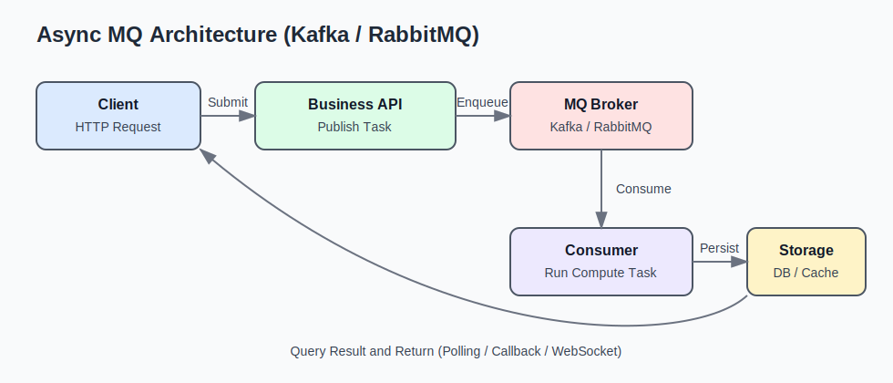

## 引入原因

在开发一个web系统中，由于核心算法是计算密集型，耗时较长，必须和业务端异步，因此引入消息队列进行解耦。

其次是对不同模块的解耦，我考虑过使用微服务进行分离部署，计算服务和业务端通过http进行通信，但是为了避免对数据模型重复进行结构体代码的实现以及不想重复部署web服务导致在测试阶段需要额外考虑到分布式部署的网络环境、设备分配等工作。

引入队列，不仅满足我的异步需求，也能最大限度上保证性能和易部署。

## 选择一：Kafka

这个队列是大名鼎鼎的“高吞吐”选手，尤其适合日志、埋点、事件流和大规模异步计算场景。它最吸引我的点在于：**吞吐高、顺序性可控、扩展性强**。

### 为什么先尝试 Kafka

在我的场景里，核心任务是“计算密集型 + 可异步处理”，消息一旦入队，不需要马上返回结果，而是允许消费者稍后处理。Kafka 的特性和这个需求比较匹配：

- 分区模型天然支持并行消费，吞吐容易做上去。
- 消费者组机制清晰，水平扩展成本低。
- 持久化与回放能力好，方便问题排查与补算。

### 初期使用感受

Kafka 的能力确实强，但它并不是“开箱就省心”的那类中间件。尤其在个人项目或小规模系统里，常见挑战主要是：

- 运维和配置复杂度相对高（broker、topic、partition、副本等概念多）。
- 对消息模型的设计要求更高，需要提前规划 key 和分区策略。
- 如果业务并不追求极致吞吐，使用成本会显得偏重。

对我来说，Kafka 更像是“上限很高”的工具，适合中后期数据规模上来后发力。

## 选择二：RabbitMQ

在继续评估后，我也尝试了 RabbitMQ。它的定位更偏“业务消息队列”，在可靠投递、路由模型、上手难度方面，对中小项目更友好。

### RabbitMQ 的优势

- **路由模型灵活**：`direct`、`topic`、`fanout` 等交换机非常适合业务拆分。
- **确认机制成熟**：生产者确认、消费者 ACK、死信队列都比较完善。
- **学习曲线平缓**：概念集中在 exchange/queue/binding，团队更容易统一认知。

在我的 web 系统中，RabbitMQ 让“异步任务分发”与“模块解耦”都更容易落地，尤其是在开发和测试阶段，排错成本更低。

## 架构示意

下面是我最终采用的异步处理链路（业务服务 + 计算服务 + 结果回传）：

## Kafka vs RabbitMQ：我的结论

我最后的结论不是“谁更好”，而是“谁更适合当前阶段”：

- **数据量巨大、偏流式处理、强调吞吐**：优先 Kafka。
- **业务消息驱动、强调路由与交付可靠性、团队快速落地**：优先 RabbitMQ。

如果是像我这样以“先把业务跑起来”为目标的项目，RabbitMQ 往往是更平衡的起点；等到数据规模和消费模型变复杂，再迁移或引入 Kafka 也完全可行。

## 小结

消息队列的本质价值在于“把同步耦合改成异步协作”。  
它解决的不是某个框架技巧，而是系统在性能、稳定性和演进能力上的结构性问题。对学生项目或早期系统来说，先选一个自己能稳定维护的方案，比盲目追求技术栈“最强”更重要。

