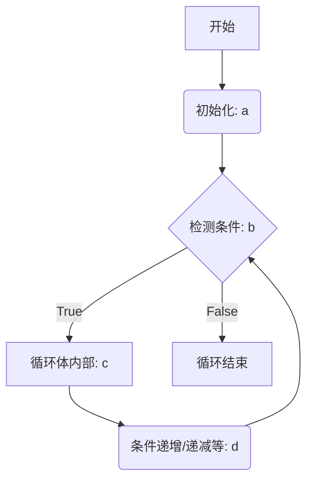
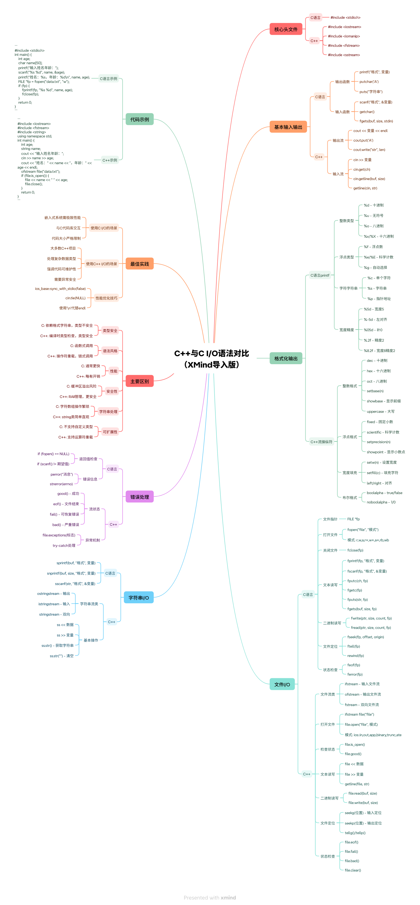
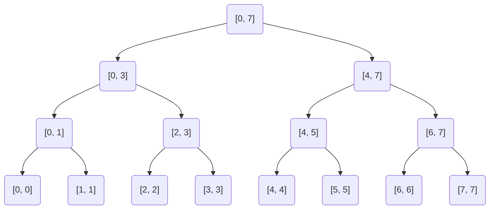

# 导读

本文内容较长，建议按“语法基础 -> 内存与多态 -> STL与算法 -> 工程实践”分段阅读，并配合算法复盘笔记使用。

# 基础语法

## C语言的字符和字符串

### 为什么使用单引号包裹 `'\n'`？

在 C 语言中，**字符常量**必须用单引号括起来，例如 `'a'`、`'0'`、`'\n'`。这里的 `'\n'` 是一个转义字符，代表换行符。`getchar()` 函数返回的是读取到的字符的 ASCII 码值（以 `int` 形式返回），因此需要用字符常量与它进行比较，以判断当前读取的字符是否是换行符。
如果用双引号 `"\n"`，则代表一个字符串常量（实际上是一个字符数组，末尾隐含 `'\0'`），与 `getchar()` 返回的单个整数值无法直接比较，会导致类型不匹配。

### 2. 为什么使用 `&tree[n]` 而不是直接使用 `tree[n]`？

`scanf` 函数需要通过**指针**（即变量的地址）来存储输入的值。

- `tree[n]` 表示数组 `tree` 中第 `n` 个元素的值，是一个整数值（例如可能是一个未初始化的随机值）。如果直接传给 `scanf`，它会把这个值当作地址去写入，导致程序崩溃或未定义行为。
- `&tree[n]` 才是该元素的**内存地址**，`scanf` 通过这个地址将读取到的整数存入对应的内存位置。

因此，必须使用取地址符 `&`。

## for循环

### for循环执行顺序

```cpp
for(a;b;d)
{ 
   std::cout<<"hello world"<<"step c"<<std::endl;
}
```

执行顺序如下


## 类

包括继承多态等语法

## cpp和c的 IO处理对比





## 多态智能指针

## 多态中使用智能指针

### 1 多态基础回顾

#### 1.1 什么是多态
- 基类指针/引用调用派生类重写的虚函数
- 运行时动态决定调用哪个函数

#### 1.2 传统多态实现（手动管理）
```cpp
class Animal {
public:
    virtual void speak() const { cout << "动物叫\n"; }
    virtual ~Animal() = default;  // 虚析构必不可少
};

class Dog : public Animal {
public:
    void speak() const override { cout << "汪汪\n"; }
};

// 使用方式
Animal* animal = new Dog();
animal->speak();  // 输出：汪汪
delete animal;    // 必须手动释放
```

### 2 为什么多态需要智能指针

#### 2.1 手动管理的痛点
##### 痛点1：忘记释放

```cpp
void func() {
    Animal* a = new Dog();
    if (出错条件) return;  // ❌ 忘记delete
    delete a;
}
```

##### 痛点2：异常不安全

```cpp
void func() {
    Animal* a = new Dog();
    throw exception();  // ❌ delete不会执行
    delete a;
}
```

##### 痛点3：所有权不明确

```cpp
Animal* createAnimal() { return new Dog(); }
// 谁负责delete？调用者知道吗？
```

##### 痛点4：容器管理复杂

```cpp
vector<Animal*> zoo;
zoo.push_back(new Dog());
zoo.push_back(new Cat());
// 必须遍历delete，容易遗漏
```

### 3 智能指针在多态中的应用

#### 3.1 unique_ptr（独占所有权）

##### 基本用法

```cpp
#include <memory>

// 创建
unique_ptr<Animal> dog = make_unique<Dog>();
dog->speak();  // 汪汪

// 函数返回值（转移所有权）
unique_ptr<Animal> createAnimal() {
    return make_unique<Dog>();
}

auto animal = createAnimal();
animal->speak();

// 容器存储
vector<unique_ptr<Animal>> zoo;
zoo.push_back(make_unique<Dog>());
zoo.push_back(make_unique<Cat>());

for (auto& animal : zoo) {
    animal->speak();  // 自动调用正确版本
}
// vector销毁时自动释放所有对象
```

##### 多态数组

```cpp
// 存储派生类对象数组
vector<unique_ptr<Animal>> animals;
animals.push_back(make_unique<Dog>());
animals.push_back(make_unique<Cat>());
animals.push_back(make_unique<Dog>());

// 多态调用
for (const auto& animal : animals) {
    animal->speak();
}
```

#### 3.2 shared_ptr（共享所有权）

##### 基本用法

```cpp
// 创建
shared_ptr<Animal> dog1 = make_shared<Dog>();
auto dog2 = dog1;  // 引用计数+1，共享所有权

dog1->speak();  // 汪汪
dog2->speak();  // 汪汪

// 函数传参（共享所有权）
void processAnimal(shared_ptr<Animal> animal) {
    animal->speak();
}

auto dog = make_shared<Dog>();
processAnimal(dog);  // 传递，引用计数临时+1
dog->speak();        // dog仍然有效
```

##### 容器存储

```cpp
vector<shared_ptr<Animal>> zoo;
auto dog = make_shared<Dog>();
auto cat = make_shared<Cat>();

zoo.push_back(dog);
zoo.push_back(cat);
zoo.push_back(dog);  // 同一个对象可以多次添加

// 所有shared_ptr共享所有权
```

#### 3.3 weak_ptr（打破循环引用）

##### 循环引用问题

```cpp
// ❌ 错误示例：循环引用导致内存泄漏
class Node {
    shared_ptr<Node> next;
    shared_ptr<Node> prev;  // 造成循环引用
public:
    virtual ~Node() = default;
};

auto n1 = make_shared<Node>();
auto n2 = make_shared<Node>();
n1->next = n2;
n2->prev = n1;  // 循环引用，两个对象都无法释放
```

##### 使用weak_ptr解决

```cpp
// ✅ 正确示例：使用weak_ptr打破循环
class Node : public Animal {
    shared_ptr<Node> next;
    weak_ptr<Node> prev;  // 弱引用，不影响计数
public:
    void speak() const override { cout << "Node\n"; }
    ~Node() { cout << "Node释放\n"; }
};

auto n1 = make_shared<Node>();
auto n2 = make_shared<Node>();
n1->next = n2;
n2->prev = n1;  // weak_ptr，不增加引用计数
// 离开作用域时，两个节点都能正确释放
```

### 4 实际应用场景

#### 4.1 工厂模式

```cpp
class AnimalFactory {
public:
    static unique_ptr<Animal> createAnimal(const string& type) {
        if (type == "dog") return make_unique<Dog>();
        if (type == "cat") return make_unique<Cat>();
        return nullptr;
    }
};

// 使用
auto animal = AnimalFactory::createAnimal("dog");
animal->speak();
```

#### 4.2 观察者模式

```cpp
class Observer {
public:
    virtual void update() = 0;
    virtual ~Observer() = default;
};

class Subject {
    vector<weak_ptr<Observer>> observers;  // 弱引用避免干扰生命周期
public:
    void addObserver(shared_ptr<Observer> obs) {
        observers.push_back(obs);
    }
    
    void notify() {
        for (auto& weakObs : observers) {
            if (auto obs = weakObs.lock()) {  // 检查是否还存活
                obs->update();
            }
        }
    }
};
```

#### 4.3 组合模式

```cpp
class Component {
public:
    virtual void operation() = 0;
    virtual void add(shared_ptr<Component>) {}
    virtual ~Component() = default;
};

class Leaf : public Component {
public:
    void operation() override { cout << "叶子\n"; }
};

class Composite : public Component {
    vector<shared_ptr<Component>> children;
public:
    void add(shared_ptr<Component> child) override {
        children.push_back(child);
    }
    
    void operation() override {
        cout << "组合：\n";
        for (auto& child : children) {
            child->operation();  // 多态调用
        }
    }
};
```

### 5 智能指针多态的最佳实践

#### 5.1 选择原则

| 场景 | 推荐类型 | 原因 |
|------|---------|------|
| 工厂模式返回值 | `unique_ptr` | 明确所有权转移 |
| 容器存储对象 | `unique_ptr` | 容器独占所有权 |
| 多处共享对象 | `shared_ptr` | 引用计数管理 |
| 避免循环引用 | `weak_ptr` | 不影响生命周期 |
| 函数参数（只使用） | 原始指针或引用 | 不涉及所有权 |
| 函数参数（共享） | `shared_ptr` | 参与所有权 |

#### 5.2 虚析构函数的重要性

```cpp
// ✅ 必须：基类要有虚析构
class Animal {
public:
    virtual void speak() = 0;
    virtual ~Animal() = default;  // 虚析构必不可少
};

// 否则会导致派生类析构不完全
unique_ptr<Animal> ptr = make_unique<Dog>();
// ptr释放时会正确调用Dog的析构函数（因为基类虚析构）
```

#### 5.3 类型转换

```cpp
// unique_ptr类型转换
unique_ptr<Animal> animal = make_unique<Dog>();

// 向下转换（需要小心）
if (auto dog = dynamic_cast<Dog*>(animal.get())) {
    dog->dogSpecificMethod();
}

// shared_ptr类型转换
shared_ptr<Animal> animal = make_shared<Dog>();
auto dog = dynamic_pointer_cast<Dog>(animal);
if (dog) {
    dog->dogSpecificMethod();
}
```

#### 5.4 自定义删除器

```cpp
// 特殊资源需要自定义删除
class DatabaseConnection : public Animal {
    // ...
    void close() { cout << "关闭数据库\n"; }
};

auto deleter = [](DatabaseConnection* conn) {
    conn->close();
    delete conn;
};

unique_ptr<DatabaseConnection, decltype(deleter)> 
    conn(new DatabaseConnection(), deleter);
```

### 6 代码示例对比

#### 6.1 手动管理 vs 智能指针

##### 手动管理版本（问题多）

```cpp
class Zoo {
    vector<Animal*> animals;
public:
    ~Zoo() {
        for (auto a : animals) delete a;  // 容易忘记
    }
    
    void add(Animal* a) { animals.push_back(a); }
    
    void process() {
        for (auto a : animals) a->speak();
    }
};

// 使用
Zoo zoo;
zoo.add(new Dog());  // 谁负责delete？容易混乱
zoo.add(new Cat());
// 可能忘记delete，可能二次删除
```

##### 智能指针版本（安全简洁）

```cpp
class Zoo {
    vector<unique_ptr<Animal>> animals;  // 明确所有权
public:
    void add(unique_ptr<Animal> a) { 
        animals.push_back(move(a)); 
    }
    
    void process() {
        for (const auto& a : animals) a->speak();
    }
    // 不需要析构函数，自动释放
};

// 使用
Zoo zoo;
zoo.add(make_unique<Dog>());  // 所有权明确转移
zoo.add(make_unique<Cat>());
// 离开作用域自动释放，绝对安全
```

#### 6.2 复杂继承体系

```cpp
class Shape {
public:
    virtual double area() const = 0;
    virtual ~Shape() = default;
};

class Circle : public Shape {
    double radius;
public:
    Circle(double r) : radius(r) {}
    double area() const override { return 3.14 * radius * radius; }
};

class Rectangle : public Shape {
    double width, height;
public:
    Rectangle(double w, double h) : width(w), height(h) {}
    double area() const override { return width * height; }
};

// 智能指针集合
vector<unique_ptr<Shape>> shapes;
shapes.push_back(make_unique<Circle>(5.0));
shapes.push_back(make_unique<Rectangle>(4.0, 6.0));

// 多态计算总面积
double total = 0;
for (const auto& shape : shapes) {
    total += shape->area();  // 自动调用正确版本
}
cout << "总面积：" << total << endl;
// 自动释放，无内存泄漏
```

### 7 总结要点

#### 7.1 核心原则

1. **优先使用`unique_ptr`**：大多数场景的默认选择
2. **需要共享时用`shared_ptr`**：明确需要共享所有权
3. **`weak_ptr`打破循环**：避免循环引用
4. **基类必须有虚析构**：确保正确释放派生类资源
5. **明确所有权语义**：智能指针类型表达意图

#### 7.2 安全优势

- ✅ 自动释放，杜绝内存泄漏
- ✅ 异常安全，RAII保证
- ✅ 明确所有权，代码自文档
- ✅ 避免野指针和二次删除
- ✅ 容器管理简单安全

#### 7.3 注意事项
- ⚠️ 不要用`auto_ptr`（已废弃）
- ⚠️ 避免循环引用
- ⚠️ 不要混用原始指针和智能指针管理同一资源
- ⚠️ 需要多态时，基类析构函数必须为虚
- ⚠️ 使用`make_unique`/`make_shared`而不是`new`

智能指针将多态编程从繁琐的内存管理中解放出来，让你专注于业务逻辑，是现代C++多态编程的基石。

## strlen、memcp

str会把0值当作字符串的终止从而返回不完整的长度，应该避免使用strlen处理二进制字节数据，避免错误预估长度。

而是直接使用固定长度字节进行偏置处理二进制数据。

# 表示范围

int类型一般是32位置，表示范围是 -2.1 x 10<sup>9</sup> 到 +2.1 x 10<sup>9</sup> (正负二十一亿左右)。

long long类型是64位，一般在 -9 x 10<sup>18</sup> 到 +9 x 10<sup>18</sup>

# 常见io处理

cin会读取输入流，但是会跳过空白输入符号，包括换行和空格输入
## 加速 I/O 代码解释

```cpp
// ...existing code...
int main() {
    // 加速 C++ IO
    std::ios_base::sync_with_stdio(false);
    std::cin.tie(NULL);

    std::string line;
    std::getline(std::cin, line); // 读取整行输入

    ParsedInput input = parseInput(line);
// ...existing code...
```

1.  **`std::ios_base::sync_with_stdio(false);`**
    *   **作用**：这条语句用来解除 C++ 标准流 (`std::cin`, `std::cout` 等) 与 C 标准流 (`stdio` 系列函数如 `scanf`, `printf` 等) 之间的同步。
    *   **背景**：默认情况下，为了兼容性，C++ 的 I/O 流与 C 的 I/O 流是同步的。这意味着每次 C++ 流进行操作时，它可能会刷新 C 流的缓冲区，反之亦然。这种同步会带来额外的开销，尤其是在大量输入输出操作时，会显著降低程序速度。
    *   **效果**：将其设置为 `false` 后，C++ 流将使用自己独立的缓冲区，不再与 C 流同步，从而提高 I/O 效率。
    *   **注意**：一旦调用了 `std::ios_base::sync_with_stdio(false);`，就不应该再混合使用 C++ 流 (`cin`/`cout`) 和 C 风格的 I/O (`scanf`/`printf`)。如果混合使用，可能会导致输出顺序混乱或输入读取不正确。在竞赛编程中，通常只使用一种风格的 I/O。

2.  **`std::cin.tie(NULL);`** (或者 `std::cin.tie(nullptr);`)
    *   **作用**：这条语句用来解除 `std::cin` 与 `std::cout` 之间的绑定。
    *   **背景**：默认情况下，`std::cin` 是与 `std::cout` 绑定的。这意味着在每次执行输入操作 (例如使用 `std::cin >> variable;`) 之前，`std::cout` 的缓冲区会被自动刷新 (flush)。这样做是为了确保在用户输入之前，所有程序已经产生的提示信息（例如 "请输入一个数字："）都已经被显示出来，这在交互式程序中是很有用的。
    *   **效果**：将其设置为 `NULL` (或 `nullptr`) 后，`std::cin` 不再强制刷新 `std::cout`。在非交互式、需要大量快速 I/O 的场景（如竞赛编程），这种自动刷新是不必要的开销。解除绑定可以避免这些不必要的刷新，从而提高速度。
    *   **注意**：如果你的程序确实需要在输入前确保某些输出已经被显示（例如，打印提示信息后等待用户输入），那么解除绑定后，你可能需要手动调用 `std::cout << std::flush;` 或在输出后使用 `std::endl` (它除了换行也会刷新缓冲区) 来确保输出及时显示。但在竞赛中，通常输出是一次性的，或者对实时交互性要求不高。

**总结**：这两行代码是竞赛编程中常用的优化手段，用于在处理大量输入输出时显著提升程序的运行速度。

## 常见的处理输入的方法以及函数

C++ 提供了多种处理输入的方式，主要通过 `<iostream>` 头文件中的 `std::cin` 对象。

1.  **使用 `>>` 操作符 (提取操作符)**
    *   **用法**：`std::cin >> variable1 >> variable2 >> ...;`
    *   **特点**：
        *   这是最常用的读取格式化输入的方法。
        *   它会跳过输入流中开头的空白字符（空格、制表符、换行符等）。
        *   然后根据变量的类型读取并转换数据。
        *   当遇到不符合变量类型的数据或下一个空白字符时，读取停止。
    *   **示例**：
        ```cpp
        int age;
        double salary;
        std::string name;
        std::cout << "请输入年龄、薪水和名字 (用空格分隔): ";
        std::cin >> age >> salary >> name; 
        // 输入: 25 5000.50 Alice
        // age 会是 25, salary 会是 5000.5, name 会是 "Alice"
        ```
    *   **读取单个字符**：`char ch; std::cin >> ch;` (会跳过空白)
    *   **读取字符串**：`std::string s; std::cin >> s;` (会以空白字符为分隔符，只读取一个单词)

2.  **`std::getline(std::istream& is, std::string& str, char delim = '\n')`**
    *   **用法**：`std::getline(std::cin, line_string);` 或 `std::getline(std::cin, line_string, delimiter_char);`
    *   **特点**：
        *   用于读取一整行输入，直到遇到换行符 `\n` (默认) 或指定的分隔符 `delim`。
        *   换行符或分隔符会从输入流中被读取并丢弃，但不会存储在 `str` 中。
        *   它不会跳过行首的空白字符。
    *   **示例**：
        ```cpp
        std::string fullName;
        std::cout << "请输入全名: ";
        std::getline(std::cin, fullName); 
        // 输入: John Doe Smith
        // fullName 会是 "John Doe Smith"
        
        std::string data;
        std::cout << "请输入以逗号分隔的数据: ";
        std::getline(std::cin, data, ','); 
        // 输入: part1,part2,rest
        // 第一次调用后 data 会是 "part1"
        ```
    *   **与 `std::cin >> std::string` 的区别**：`std::cin >> s;` 只读取到第一个空白字符，而 `std::getline` 读取一整行或直到指定分隔符。
    *   **常见陷阱**：如果在 `std::cin >> some_variable;` 之后立即使用 `std::getline(std::cin, line);`，可能会遇到问题。因为 `>>` 操作符会把换行符留在输入缓冲区中，`std::getline` 读到的第一个字符就是这个换行符，导致读到空行。解决方法是在两者之间使用 `std::cin.ignore()` 来清除缓冲区中残留的换行符：
        ```cpp
        int num;
        std::cin >> num;
        std::cin.ignore(std::numeric_limits<std::streamsize>::max(), '\n'); // 忽略掉 num 后面的换行符
        std::string line_after_num;
        std::getline(std::cin, line_after_num);
        ```

3.  **`std::cin.get()` 系列函数**
    *   **`int std::cin.get()`**: 读取单个字符（包括空白字符），并将其作为 `int` 返回。如果到达文件末尾，返回 `EOF`。
        ```cpp
        char c1 = std::cin.get(); 
        ```
    *   **`std::istream& std::cin.get(char& ch)`**: 读取单个字符（包括空白字符）并存入 `ch`。返回对 `std::cin` 的引用。
        ```cpp
        char c2;
        std::cin.get(c2);
        ```
    *   **`std::istream& std::cin.get(char* s, std::streamsize n, char delim = '\n')`**: 读取最多 `n-1` 个字符到字符数组 `s` 中，或者直到遇到分隔符 `delim`。分隔符不会被读取到 `s` 中，但会留在输入流中。会在 `s` 的末尾添加空字符 `\0`。
        ```cpp
        char buffer[100];
        std::cin.get(buffer, 100); // 读取一行到 buffer，最多99个字符
        ```

4.  **`std::cin.read(char* s, std::streamsize n)`**
    *   **用法**：`std::cin.read(buffer, count);`
    *   **特点**：用于读取固定数量 `n` 个字符到字符数组 `s` 中，不关心内容是否是空白或分隔符，也不会自动添加空终止符。主要用于二进制输入或需要精确控制读取字节数的场景。
    *   可以通过 `std::cin.gcount()` 获取实际读取的字符数。

5.  **检查输入状态**
    *   `std::cin.good()`: 如果流处于良好状态，返回 `true`。
    *   `std::cin.fail()`: 如果发生可恢复的错误（如格式不匹配），返回 `true`。流仍然可用，但需要清除错误状态 (`std::cin.clear()`) 并可能忽略错误输入 (`std::cin.ignore()`)。
    *   `std::cin.bad()`: 如果发生不可恢复的错误（如读取错误），返回 `true`。
    *   `std::cin.eof()`: 如果到达文件末尾，返回 `true`。
    *   可以直接在条件语句中使用 `std::cin` 对象本身来判断状态：`if (std::cin)` 等价于 `if (!std::cin.fail())`。
        ```cpp
        int val;
        while (std::cin >> val) { // 当输入成功时循环
            // 处理 val
        }
        // 循环结束可能是因为到达文件末尾或输入了非整数
        if (std::cin.eof()) {
            // 到达文件末尾
        } else if (std::cin.fail()) {
            std::cout << "输入错误!\n";
            std::cin.clear(); // 清除错误标志
            std::cin.ignore(std::numeric_limits<std::streamsize>::max(), '\n'); // 忽略错误行
        }
        ```

在你的代码中，`std::getline(std::cin, line);` 用于读取包含字符串和整数 `k` 的整行输入，这是合适的，因为输入格式是 `"string_val",int_val`，其中 `string_val` 本身不包含逗号，但整行输入作为一个单元进行解析更方便。

你提出的问题非常好，涉及到 C++ I/O 流中缓冲区的刷新机制和流操纵符 (manipulators) 的概念。

### `std::endl` 是什么操作？

`std::endl` 是一个定义在 `<ostream>` 头文件中的**流操纵符 (manipulator)**。当你执行 `std::cout << std::endl;` 时，它会执行两个操作：

1.  **插入一个换行符 (`\n`)**：它向输出流 `std::cout` 中写入一个换行符，使得后续的输出会从新的一行开始。
2.  **刷新输出缓冲区 (Flush the buffer)**：它会强制将与 `std::cout`关联的输出缓冲区中的所有内容立即发送到最终的目的地（通常是控制台屏幕）。

**示例：**
```cpp
std::cout << "第一行";
std::cout << std::endl; // 输出 "第一行"，然后换行，并刷新缓冲区
std::cout << "第二行";
```
输出：
```
第一行
第二行
```

### `std::flush` 是什么操作？

`std::flush` 也是一个定义在 `<ostream>` 头文件中的**流操纵符 (manipulator)**。当你执行 `std::cout << std::flush;` 时，它只执行一个操作：

1.  **刷新输出缓冲区 (Flush the buffer)**：它会强制将与 `std::cout` 关联的输出缓冲区中的所有内容立即发送到最终的目的地。它**不会**插入换行符。

**示例：**
```cpp
std::cout << "正在处理... "; // 输出 "正在处理... "，但不换行
std::cout << std::flush;    // 确保 "正在处理... " 立即显示出来
// ... 假设这里有一些耗时操作 ...
std::cout << "完成！\n";    // 输出 "完成！" 并换行
```
输出可能是（"正在处理..." 会立即出现，然后过一段时间出现 "完成！"）：
```
正在处理... 完成！
```
如果省略 `std::cout << std::flush;`，并且后续没有 `std::endl` 或其他刷新操作，那么 "正在处理... " 可能会一直留在缓冲区中，直到程序结束或缓冲区满了才显示，这在需要实时反馈的场景下是不希望看到的。

## 标准库的io函数介绍
### 为什么 `std::flush` (和 `std::endl`) 是“传入”到 `std::cout` 中的？(流操纵符的工作原理)

`std::flush` 和 `std::endl` 看起来像是被“传入”到 `std::cout`，这是因为它们是**流操纵符 (manipulators)**，并且 C++ 的 `<<` (输出操作符或插入操作符) 被重载以接受这些操纵符。

**工作原理简述：**

1.  **函数指针或函数对象**：像 `std::endl` 和 `std::flush` 这样的操纵符，实际上是特殊类型的函数（或者更准确地说，它们是返回特定函数指针的函数，或者本身就是可以被流调用的函数对象）。这些函数接受一个输出流对象 (如 `std::ostream&`) 作为参数，并返回该流对象的引用。

2.  **操作符重载**：`std::ostream` 类 (`std::cout` 是其实例) 重载了 `operator<<`，使其可以接受这种特定签名的函数指针或函数对象。

3.  **调用机制**：当你写 `std::cout << std::flush;` 时：
    *   `std::flush` (作为一个操纵符) 被传递给 `operator<<`。
    *   重载的 `operator<<` 内部会调用与 `std::flush` 关联的那个特殊函数，并将 `std::cout` 自身作为参数传递给这个函数。
    *   这个特殊函数接着对 `std::cout` 执行其预定的操作（对于 `std::flush`，就是调用 `std::cout.flush()` 方法）。
    *   最后，这个特殊函数返回对 `std::cout` 的引用，使得链式操作成为可能 (例如 `std::cout << "Hello" << std::flush << " World";`)。

**可以这样理解：**
`std::cout << std::flush;` 实际上是一种语法糖，它等效于更底层的操作，比如直接调用流对象的成员函数 `std::cout.flush();`。

**`std::endl` 的实现（概念上）：**
```cpp
// 这是一个简化的概念性表示，实际实现更复杂
namespace std {
    template <class CharT, class Traits>
    inline basic_ostream<CharT, Traits>& endl(basic_ostream<CharT, Traits>& os) {
        os.put(os.widen('\n')); // 插入换行符
        os.flush();             // 刷新缓冲区
        return os;
    }

    template <class CharT, class Traits>
    inline basic_ostream<CharT, Traits>& flush(basic_ostream<CharT, Traits>& os) {
        os.flush();             // 刷新缓冲区
        return os;
    }
}
```
当你写 `std::cout << std::endl;` 时，编译器会找到一个合适的 `operator<<` 重载，这个重载会调用 `std::endl(std::cout);`。

**总结：**

*   `std::endl` = 换行 + 刷新。
*   `std::flush` = 仅刷新。
*   它们被称为流操纵符，通过 `operator<<` 的重载机制作用于流对象，以一种简洁的方式执行特定的流操作。
*   当你使用 `std::cin.tie(NULL);` 解除了 `cin` 和 `cout` 的绑定后，`cout` 不会在每次 `cin` 操作前自动刷新。在这种情况下，如果你需要确保某些输出立即显示（例如在等待用户输入之前打印提示，或者在程序的不同阶段显示进度），你就需要显式使用 `std::endl` (如果也需要换行) 或 `std::cout << std::flush;` (如果不需要换行) 来强制刷新缓冲区。

# array和vector

### 为什么 std::array 没有 (大小, 初始值)构造函数？

这个问题的答案在于 `std::array` 的本质：

1.  **大小在编译时确定**: `std::array` 的大小是其类型的一部分，通过模板参数指定（例如 `array<long, **3**>`）。编译器在编译时就已经确切地知道了数组的大小是 `3`。因此，在运行时通过构造函数参数再告诉它一次大小是多余的。

2.  **静态聚合类型**: `std::array` 被设计为一个**聚合类型 (Aggregate Type)**。它本质上只是对 C 风格数组 (`long arr[3]`) 的一个轻量级、更安全的封装。聚合类型最自然的初始化方式是使用**初始化列表 (`{...}`)**，而不是复杂的构造函数。

### std::vector 为什么有 (大小, 初始值)构造函数？

与 `std::array` 相反，`std::vector` 是一个**动态容器**：**大小在运行时确定**: `std::vector` 的大小可以在程序运行时改变。因此，它**必须**有一个构造函数来告诉它在创建时需要动态分配多大的内存，以及用什么值来填充这些内存。`vector<long> dp2(3,0);` 正是做了这件事。

| 特性 | `std::array<T, N>` | `std::vector<T>` |
| :--- | :--- | :--- |
| **大小** | **编译时**固定 (模板参数 `N`) | **运行时**可变 |
| **内存** | 栈上分配 (作为对象的一部分) | 堆上动态分配 |
| **` (size, value) ` 构造** | **没有** (大小已在类型中确定) | **有** (需要在运行时指定大小) |
| **推荐初始化** | 初始化列表 (`{...}`) | 构造函数或初始化列表 |

核心区别：`std::array` 的大小是其**类型**的一部分，而 `std::vector` 的大小是其**状态**的一部分。


### array使用 memcpy 拷贝

```cpp
// .data() 返回指向数据的裸指针
memcpy(dp2.data(), dp1.data(), sizeof(dp1));
```

### sort和map

std::sort-是就地排序，会对元素内部的元素顺序进行修改；使用内省排序算法。

#### Introsort 的工作原理

1. **主体是快速排序 (Quicksort)**：在绝大多数情况下，它会使用快速排序，因为快速排序在平均情况下的性能非常好，常数因子也比较小。
2. **防止最坏情况**：它会检测快速排序的递归深度。如果递归深度过大（这通常发生在数据基本有序或逆序，导致快速排序性能退化到 O(N²) 的情况下），它会自动**切换到堆排序 (Heapsort)**。堆排序的优点是它的最坏时间复杂度也是 O(N log N)，从而保证了整体性能不会崩溃。    
3. **处理小区间**：当递归到子数组的规模非常小时（例如，元素数量小于 16），它会再次**切换到插入排序 (Insertion Sort)**。因为对于小规模的数据，插入排序的简单循环结构比复杂的递归调用更有效率。

std::sort 的原理是**Introsort**，它是一种集**快速排序、堆排序、插入排序**三者优点于一身的混合排序算法，旨在在各种数据模式下都能提供稳定且高效的 O(N log N) 性能。

#### map（cpp）

本质上和set是一个东西，有红黑树和散列表两种实现，前者有序后者无序但是查速度是O(1)，当仅仅是简单分类的时候使用后者**unordered_map**即可

## 单调栈

在算法领域，当我们说一个栈是“单调递增”还是“单调递减”时，我们通常指的是：

1. 观察的对象是**元素的值**（在这里是 height 的值），而不是它们的索引。
2. 观察的方向是**从栈底到栈顶**。

## 双指针窗口滑动

### 适用场合

这种问题单调滑动只适用于全是正整数的假设前提，才能保证left右移减小，right右移增大的单调条件。

一旦遇到负数，动窗口的“收缩使和变小，扩张使和变大”这一单调性就不再成立了，导致原有逻辑会失效并错过很多解。

### 重复问题

可以记录某一个元素上一次出现的位置map，一旦右边界发现重复，可以让左边界（如果这个元素上一次位置依然在窗口内部）直接根据map种的记录直接跳跃到（上一次位置+1），可以直接将窗口内的重复元素剔除窗口中。

### 有负数（范围是整数）

有负数的时候需要前缀和数组/map。

#### 前缀和：

前缀和数组 `prefix` 是对原始数组 [nums](vscode-file://vscode-app/c:/APP/Microsoft%20VS%20Code/resources/app/out/vs/code/electron-browser/workbench/workbench.html) 的一种预处理。`prefix` 数组中的第 [i](vscode-file://vscode-app/c:/APP/Microsoft%20VS%20Code/resources/app/out/vs/code/electron-browser/workbench/workbench.html) 个元素 `prefix[i]` 存储的是原始数组 [nums](vscode-file://vscode-app/c:/APP/Microsoft%20VS%20Code/resources/app/out/vs/code/electron-browser/workbench/workbench.html) 从**开头到第 [i](vscode-file://vscode-app/c:/APP/Microsoft%20VS%20Code/resources/app/out/vs/code/electron-browser/workbench/workbench.html) 个位置**的所有元素的总和。

**定义：** `prefix[i] = nums[0] + nums[1] + ... + nums[i]`

**举个例子：** 如果原始数组 [nums = [1, 2, 3, 4, 5]](vscode-file://vscode-app/c:/APP/Microsoft%20VS%20Code/resources/app/out/vs/code/electron-browser/workbench/workbench.html) 那么它的前缀和数组 `prefix` 就是：

- `prefix[0] = nums[0] = 1`
- `prefix[1] = nums[0] + nums[1] = 1 + 2 = 3`
- `prefix[2] = nums[0] + nums[1] + nums[2] = 1 + 2 + 3 = 6`
- `prefix[3] = 1 + 2 + 3 + 4 = 10`
- `prefix[4] = 1 + 2 + 3 + 4 + 5 = 15`

所以，`prefix = [1, 3, 6, 10, 15]`。

#### 前缀和求解窗口和

前缀和最大的作用是能够让你在 **O(1) 的时间复杂度**内，快速求出原始数组**任意一个连续子数组的和**。

**核心公式：** 要求出子数组 nums[i...j]从索引 [i] 到 [j]的和，我们只需要：

sum(i, j) = prefix[j] - prefix[i-1]

并且可以使用map记录对应前缀和出现的次数，这样可以利用map的查找效率，在O(1)时间内查找到所有的满足要求的组合数量。

# 线段树

## 除以二

```cpp
int m = (l + r) >> 1
```

**`>> 1` 是什么？**

- `>>` 是 C++ 中的**按位右移**运算符。
- x >> 1 的意思是将数字 x 的二进制表示向右移动一位。
- 对于正整数来说，这在数学上等价于**整除 2** (`/ 2`)。例如，`7` 的二进制是 `0111`，右移一位变成 `0011`，即十进制的 `3`。这和 `7 / 2` 的整数结果是一样的。
- 在算法竞赛和底层代码中，**位运算通常被认为比乘除法更快**，所以这是一个常见的写法。

## 定义

**线段树**是一种专门用于高效处理**数组区间**（也称为“线段”）问题的数据结构。它本质上是一棵**二叉树**，它的结构和分治思想紧密相关。

**核心特点：**

1. **结构 (一棵二叉树)**:
   
    - **根节点**: 代表整个数组的区间，例如 `[0, n-1]`。
    - **每个父节点**: 代表一个区间 `[l, r]`。
    - **它的左子节点**: 代表区间的左半部分 `[l, m]` (m是中点)。
    - **它的右子节点**: 代表区间的右半部分 `[m+1, r]`。
    - **叶子节点**: 代表数组中的单个元素 `[i, i]`。
2. **功能 (存储区间信息)**:
   
    - 线段树的强大之处在于，每个节点上都可以存储它所代表的那个区间的**“状态信息”**。
    - 对于简单的“区间求和”问题，每个节点就存一个 [sum](vscode-file://vscode-app/c:/APP/Microsoft%20VS%20Code/resources/app/out/vs/code/electron-browser/workbench/workbench.html)。
    - 对于“最大子数组和”问题，每个节点就需要存储一个更复杂的状态，比如 `{lSum, rSum, mSum, iSum}`。

## 图解

假设我们有一个数组 [nums](vscode-file://vscode-app/c:/APP/Microsoft%20VS%20Code/resources/app/out/vs/code/electron-browser/workbench/workbench.html)，长度为8。线段树的结构就是对这条长线段 `[0, 7]` 不断切分的结果：




# 类

## 纯虚函数和虚函数区别

`virtual double area() const { return 0; }` 与 `virtual double area() const = 0;` 的区别

这是**虚函数**和**纯虚函数**的区别，也是**普通基类**与**抽象类**的区别。抽象类因为有纯虚函数无法被实例化，用于接口实现多态。

### 1. **语法对比**

```cpp
// 版本1：普通虚函数（有默认实现）
class Shape {
public:
    virtual double area() const {  // 有函数体
        return 0;  // 提供默认实现
    }
};

// 版本2：纯虚函数（无默认实现）
class Shape {
public:
    virtual double area() const = 0;  // =0，无函数体
};
```

### 2. **核心区别**

| 特性 | 普通虚函数 | 纯虚函数 (=0) |
|------|-----------|---------------|
| **是否有默认实现** | 有 | 无 |
| **类是否可实例化** | 可以实例化 | **不能实例化**（抽象类） |
| **派生类必须重写吗** | 可选 | **必须重写** |
| **设计意图** | "可以有默认行为" | "强制提供实现" |
| **构造函数中调用** | 可能有问题（静态绑定）| 语法不允许（纯虚函数无实现）|

### 3. **实际代码对比**

```cpp
// ========== 普通虚函数示例 ==========
class Animal {
public:
    virtual void sound() const {
        cout << "Some generic animal sound" << endl;
    }
};

class Dog : public Animal {
public:
    // 可选：可以重写，也可以不重写
    virtual void sound() const override {
        cout << "Woof!" << endl;
    }
};

class Cat : public Animal {
    // 没有重写 sound()，会使用基类的默认实现
};

int main() {
    Animal a;           // 可以创建 Animal 对象
    a.sound();          // 输出: Some generic animal sound
    
    Dog d;
    d.sound();          // 输出: Woof!
    
    Cat c;
    c.sound();          // 输出: Some generic animal sound（使用基类默认实现）
    
    Animal* ptr = &c;
    ptr->sound();       // 输出: Some generic animal sound
}

// ========== 纯虚函数示例 ==========
class Shape {  // 抽象类
public:
    virtual double area() const = 0;  // 纯虚函数，无实现
    virtual ~Shape() { }
};

// Shape s;  // 错误！不能实例化抽象类

class Circle : public Shape {
private:
    double radius;
public:
    Circle(double r) : radius(r) { }
    
    // 必须重写 area()
    virtual double area() const override {
        return 3.14159 * radius * radius;
    }
};

class Rectangle : public Shape {
private:
    double width, height;
public:
    Rectangle(double w, double h) : width(w), height(h) { }
    
    // 必须重写 area()
    virtual double area() const override {
        return width * height;
    }
};

int main() {
    // Shape s;  // 错误！抽象类不能实例化
    
    Circle c(5);
    Rectangle r(4, 6);
    
    Shape* shapes[] = { &c, &r };
    for (auto shape : shapes) {
        cout << "Area: " << shape->area() << endl;
    }
}
```

### 4. **设计意图的区别**

```cpp
// 场景1：普通虚函数 - "可以"重写
class Logger {
public:
    virtual void log(const string& msg) {
        // 提供基础的控制台输出
        cout << "LOG: " << msg << endl;
    }
};

class FileLogger : public Logger {
private:
    ofstream file;
public:
    FileLogger(const string& filename) {
        file.open(filename);
    }
    
    virtual void log(const string& msg) override {
        // 重写为文件输出
        file << msg << endl;
    }
};

// 场景2：纯虚函数 - "必须"重写
class Encryption {
public:
    virtual string encrypt(const string& data) const = 0;
    virtual string decrypt(const string& data) const = 0;
    virtual ~Encryption() { }
};

class AESEncryption : public Encryption {
public:
    virtual string encrypt(const string& data) const override {
        // 必须实现 AES 加密
    }
    virtual string decrypt(const string& data) const override {
        // 必须实现 AES 解密
    }
};
```

## 三种权限修饰符详解

### 1. **public、protected、private 的区别**

| 访问权限 | 本类内部 | 派生类内部 | 外部代码 |
|---------|---------|-----------|---------|
| **public** | ✔️ 可访问 | ✔️ 可访问 | ✔️ 可访问 |
| **protected** | ✔️ 可访问 | ✔️ 可访问 | ❌ 不可访问 |
| **private** | ✔️ 可访问 | ❌ 不可访问 | ❌ 不可访问 |

### 2. **为什么基类使用 protected？**

```cpp
class Vehicle {
private:
    string vin;           // 车辆识别码：完全私有，连子类也不能直接访问
    double fuel = 0;
    
protected:
    double speed = 0;     // 速度：子类可以访问和修改
    int wheels;           // 轮子数：子类可以访问
    
public:
    Vehicle(int w) : wheels(w) { }
    
    void drive() {
        cout << "Driving with " << wheels << " wheels" << endl;
    }
    
    void addFuel(double amount) {
        fuel += amount;
    }
    
    double getFuel() const {
        return fuel;
    }
};

class Car : public Vehicle {
private:
    string brand;
    
public:
    Car(string b) : Vehicle(4), brand(b) { }
    
    void accelerate() {
        // 可以访问 protected 成员
        speed += 10;  // ✔️ 可以修改 speed
        cout << "Accelerating to " << speed << " km/h" << endl;
        
        // 不能访问 private 成员
        // fuel -= 0.1;  // ❌ 错误！fuel 是 private
        
        // 只能通过 public 方法访问 private 成员
        addFuel(-0.1);  // ✔️ 通过 public 接口
    }
    
    void showInfo() {
        cout << "Brand: " << brand << ", Wheels: " << wheels << endl;
        // wheels 是 protected，子类可以访问
    }
};

int main() {
    Car myCar("Toyota");
    myCar.drive();           // ✔️ public 方法
    myCar.accelerate();      // ✔️ public 方法
    
    // myCar.speed = 100;    // ❌ 错误！speed 是 protected，外部不能访问
    // myCar.wheels = 6;     // ❌ 错误！wheels 是 protected，外部不能访问
    
    myCar.addFuel(50);       // ✔️ 通过 public 接口操作 private 数据
}
```

### 3. **为什么基类要用 protected？**

```cpp
// 错误设计：所有成员都是 private
class WrongBase {
private:
    int coreData;  // 核心数据
    int helperData;  // 辅助数据也需要通过函数访问
    
public:
    int getData() const { return coreData; }
    void setData(int d) { coreData = d; }
    // 子类每次都要调用函数，效率低
};

class WrongDerived : public WrongBase {
public:
    void process() {
        // 每次都要函数调用开销
        setData(getData() * 2);  
    }
};

// 正确设计：合理使用 protected
class RightBase {
private:
    int secretKey;      // 真正需要完全隐藏的数据
    
protected:
    int coreData;       // 子类可能需要直接操作的核心数据
    int buffer[100];    // 子类可能需要直接访问的缓冲区
    
public:
    int getData() const { return coreData; }
    void setData(int d) { coreData = d; }
    
    void publicAPI() {
        // 复杂的公共接口
        processData();
    }
    
private:
    void processData() {
        // 内部实现细节
    }
};

class RightDerived : public RightBase {
public:
    void fastProcess() {
        // 可以直接访问 protected 成员，无需函数调用开销
        coreData *= 2;  // 直接操作，效率高
    }
};
```

## 继承类和多态类的实际使用方法

### 1. **完整的实际示例：一个图形系统**

```cpp
#include <iostream>
#include <vector>
#include <cmath>
using namespace std;

// ========== 抽象基类（纯虚函数） ==========
class Shape {
protected:
    string color;
    int x, y;  // 位置
    
public:
    Shape(string c, int xPos = 0, int yPos = 0) 
        : color(c), x(xPos), y(yPos) { }
    
    // 纯虚函数：派生类必须实现
    virtual double area() const = 0;
    virtual double perimeter() const = 0;
    
    // 普通虚函数：提供默认实现
    virtual void draw() const {
        cout << "Drawing a " << color << " shape at (" << x << "," << y << ")" << endl;
    }
    
    // 非虚函数：所有派生类共享
    void move(int dx, int dy) {
        x += dx;
        y += dy;
        cout << "Moved to (" << x << "," << y << ")" << endl;
    }
    
    string getColor() const { return color; }
    
    virtual ~Shape() { }  // 虚析构函数
};

// ========== 派生类1：Circle ==========
class Circle : public Shape {
private:
    double radius;
    
public:
    Circle(string c, double r, int x = 0, int y = 0) 
        : Shape(c, x, y), radius(r) { }
    
    // 必须实现纯虚函数
    virtual double area() const override {
        return M_PI * radius * radius;
    }
    
    virtual double perimeter() const override {
        return 2 * M_PI * radius;
    }
    
    // 重写虚函数
    virtual void draw() const override {
        cout << "Drawing a " << color << " circle with radius " << radius 
             << " at (" << x << "," << y << ")" << endl;
    }
    
    // 特有方法
    double getRadius() const { return radius; }
};

// ========== 派生类2：Rectangle ==========
class Rectangle : public Shape {
protected:  // 使用protected让Square可以访问
    double width, height;
    
public:
    Rectangle(string c, double w, double h, int x = 0, int y = 0)
        : Shape(c, x, y), width(w), height(h) { }
    
    virtual double area() const override {
        return width * height;
    }
    
    virtual double perimeter() const override {
        return 2 * (width + height);
    }
    
    virtual void draw() const override {
        cout << "Drawing a " << color << " rectangle " << width << "x" << height
             << " at (" << x << "," << y << ")" << endl;
    }
};

// ========== 派生类3：Square（继承自Rectangle） ==========
class Square : public Rectangle {
public:
    Square(string c, double side, int x = 0, int y = 0)
        : Rectangle(c, side, side, x, y) { }
    
    // 可以选择重写draw
    virtual void draw() const override {
        cout << "Drawing a " << color << " square with side " << width
             << " at (" << x << "," << y << ")" << endl;
    }
    
    // 特有方法
    void setSide(double s) { width = height = s; }
    double getSide() const { return width; }
};

// ========== 使用示例 ==========
int main() {
    // 1. 创建具体对象
    Circle circle("red", 5.0, 10, 10);
    Rectangle rect("blue", 4.0, 6.0, 20, 20);
    Square square("green", 3.0, 30, 30);
    
    // 2. 直接使用派生类对象
    cout << "=== 直接使用对象 ===" << endl;
    circle.draw();
    cout << "Area: " << circle.area() << endl;
    
    rect.draw();
    rect.move(5, 5);  // 调用基类方法
    cout << "Perimeter: " << rect.perimeter() << endl;
    
    square.draw();
    square.setSide(4.0);  // 调用特有方法
    cout << "New area: " << square.area() << endl;
    
    // 3. 多态使用：基类指针数组
    cout << "\n=== 多态使用（基类指针） ===" << endl;
    vector<Shape*> shapes;
    shapes.push_back(&circle);
    shapes.push_back(&rect);
    shapes.push_back(&square);
    
    for (Shape* shape : shapes) {
        shape->draw();  // 多态调用
        cout << "Area: " << shape->area() << endl;  // 多态调用
        shape->move(1, 1);  // 调用基类非虚函数
        cout << "---" << endl;
    }
    
    // 4. 函数参数中的多态
    cout << "\n=== 函数参数中的多态 ===" << endl;
    auto printShapeInfo = [](const Shape& s) {
        s.draw();  // 多态（const引用也能调用const成员函数）
        cout << "Area: " << s.area() << endl;  // area() 是const
    };
    
    printShapeInfo(circle);
    printShapeInfo(square);
    
    // 5. 动态创建对象
    cout << "\n=== 动态创建 ===" << endl;
    Shape* dynamicShape = new Circle("yellow", 2.5);
    dynamicShape->draw();
    delete dynamicShape;  // 虚析构函数确保正确清理
    
    return 0;
}
```

### 2. **复杂实际应用：插件系统**

```cpp
// ========== 插件接口（抽象基类） ==========
class Plugin {
protected:
    string name;
    bool enabled;
    
public:
    Plugin(const string& n) : name(n), enabled(true) { }
    
    // 纯虚函数：必须实现的核心功能
    virtual void initialize() = 0;
    virtual void execute() = 0;
    virtual void shutdown() = 0;
    
    // 虚函数：可选重写
    virtual string getVersion() const {
        return "1.0.0";
    }
    
    // 非虚函数：公共功能
    void enable() { enabled = true; }
    void disable() { enabled = false; }
    bool isEnabled() const { return enabled; }
    string getName() const { return name; }
    
    virtual ~Plugin() { }
};

// ========== 具体插件1：数据处理插件 ==========
class DataProcessorPlugin : public Plugin {
private:
    vector<int> data;
    
protected:
    void processData() {
        // 内部处理方法
        for (auto& d : data) d *= 2;
    }
    
public:
    DataProcessorPlugin() : Plugin("DataProcessor") { }
    
    virtual void initialize() override {
        cout << "Initializing DataProcessor..." << endl;
        data = {1, 2, 3, 4, 5};
    }
    
    virtual void execute() override {
        if (!enabled) {
            cout << "Plugin disabled" << endl;
            return;
        }
        cout << "Processing data..." << endl;
        processData();
        for (int d : data) cout << d << " ";
        cout << endl;
    }
    
    virtual void shutdown() override {
        cout << "Shutting down DataProcessor" << endl;
        data.clear();
    }
    
    virtual string getVersion() const override {
        return "2.1.0";  // 重写版本号
    }
};

// ========== 具体插件2：网络插件 ==========
class NetworkPlugin : public Plugin {
private:
    string server;
    int port;
    
public:
    NetworkPlugin(const string& s, int p) 
        : Plugin("Network"), server(s), port(p) { }
    
    virtual void initialize() override {
        cout << "Connecting to " << server << ":" << port << endl;
    }
    
    virtual void execute() override {
        if (!enabled) return;
        cout << "Sending network request..." << endl;
        // 网络操作...
    }
    
    virtual void shutdown() override {
        cout << "Closing network connection" << endl;
    }
};

// ========== 插件管理器 ==========
class PluginManager {
private:
    vector<Plugin*> plugins;
    
public:
    void registerPlugin(Plugin* plugin) {
        plugins.push_back(plugin);
        plugin->initialize();
    }
    
    void executeAll() {
        for (Plugin* p : plugins) {
            if (p->isEnabled()) {
                p->execute();
            }
        }
    }
    
    void shutdownAll() {
        for (Plugin* p : plugins) {
            p->shutdown();
        }
    }
};

int main() {
    PluginManager manager;
    
    DataProcessorPlugin dataPlugin;
    NetworkPlugin netPlugin("localhost", 8080);
    
    manager.registerPlugin(&dataPlugin);
    manager.registerPlugin(&netPlugin);
    
    cout << "=== Executing plugins ===" << endl;
    manager.executeAll();
    
    cout << "\n=== Disabling network plugin ===" << endl;
    netPlugin.disable();
    manager.executeAll();
    
    cout << "\n=== Shutting down ===" << endl;
    manager.shutdownAll();
}
```

## 总结1

### 1. **虚函数 vs 纯虚函数**
- **虚函数**：提供默认实现，派生类可以重写也可以不重写
- **纯虚函数**：无实现，派生类**必须**重写，使类成为抽象类

### 2. **访问权限的选择**
- **private**：真正需要隐藏的实现细节
- **protected**：提供给派生类直接访问的成员
- **public**：对外公开的接口

### 3. **继承类 vs 多态类**
- **继承类**：代码复用，通过派生类对象使用特有功能
- **多态类**：接口统一，通过基类指针/引用使用不同派生类的行为


## 覆写对比

1. 纯虚函数必须由派生类覆写
2. 虚函数有默认实现，可以不实现，实现之后允许多态调用，通过基类类名::func_a（）的方式调用基类的默认实现。
3. (纯)虚函数则是根据指针动态绑定实现，没有同名隐藏一说，其可从基类指针调用绑定的派生类函数；但是普通同名函数覆写，是根据指针类型调用函数，无法实现基类指针指向派生类然后调用派生类函数。
4. override关键字用于覆盖，只用于实现虚函数或者纯虚函数，不用于普通同名函数。

# 结构初始化

## 数组


- **“默认不赋值”** 只适用于**局部非静态数组**，且只对**内置类型**（如 `int`）成立。

- **访问这些未初始化的元素**，在 C/C++ 中是**未定义行为**，通常表现为乱码，但程序也可能直接崩溃（例如指针未初始化导致的段错误）。所以一定要避免这种情况。

- 为了安全，**建议始终显式初始化数组**：

  c

  ```
  int arr[5] = {0};        // C 中全零
  int arr[5] = {};         // C++ 中全零
  ```

  

# 编译运行命令


## 单文件执行


### vs-window环境


#### cl命令

编译文件，cl 是 Microsoft Visual Studio 提供的 C++ 编译器命令行工具（全称：C/C++ Compiler）。
你可以用它在命令行（如 PowerShell 或开发者命令提示符）编译 1.cpp 文件：

```powershell
cl .\1.cpp
```

直接执行目标文件

```powershell
.\1.exe
```

但是windows环境下，在PowerShell 中使用 `cl` 命令行编译，编译器按系统默认代码页（GBK）去解析源文件，但源文件在vs编辑器之中是以 UTF-8 编码保存的（可能是无 BOM 的 UTF-8），导致中文字符被错误解析，从而引发编译错误（C3688）和运行乱码。

需要在编译命令之中指明`utf-8`才能正确解析cpp文件中的`utf-8`中文字符串

```powershell
cl /utf-8 ./1.cpp
```

#### 程序中配置

程序中也要引入如下内容确保exe程序和控制台交互的编码正确性：

```cpp
#include<Windows.h>

int main(){
    // 控制输出中文格式
    SetConsoleOutputCP(CP_UTF8);
    // 如果你还需要从控制台读取中文输入，可以加上这一句
    SetConsoleCP(CP_UTF8);

    return 0;
}
```


#### 两种配置关系

二者缺一不可，cl命令中和程序中都要配置。

| 情况                                     | 结果                                                         |
| :--------------------------------------- | :----------------------------------------------------------- |
| 只用 `/utf-8`，不调 `SetConsoleOutputCP` | exe 内部是 UTF-8，但控制台仍按 GBK 解码 → 乱码               |
| 只调 `SetConsoleOutputCP`，不用 `/utf-8` | 控制台设为 UTF-8，但 exe 内部字符串可能是 ANSI/GBK 编码 → 乱码 |

### 编译器命令

使用 g++ 或 MinGW 编译器编译并运行 C++ 程序的命令如下：

1. **编译：**
```powershell
g++ 1.cpp -o 1.exe
```
或者（如果你在 `luogu` 文件夹里）：
```powershell
g++ luogu\1.cpp -o luogu1.exe
```

2. **运行：**
```powershell
.\1.exe
```
或者

```powershell
.\luogu1.exe
```

只需在终端输入上述命令即可编译并运行 C++ 程序。


